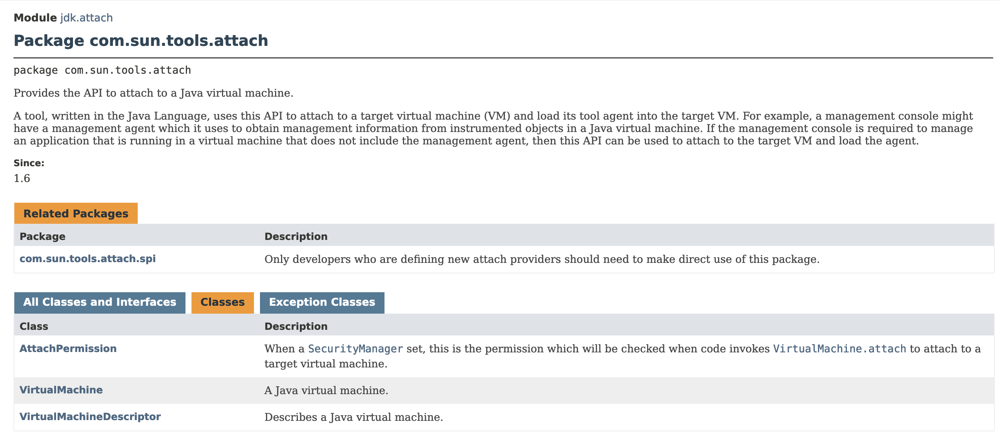

# attach API

## attach api 的官方介绍
从jdk1.6开始可以使用attach api连接到目标JVM上并让目标JVM加载Java agent。
attach api的包名称为`com.sun.tools.attach`，主要包含三个类：
AttachPermission、VirtualMachine、VirtualMachineDescriptor。


图片来源：https://docs.oracle.com/en/java/javase/20/docs/api/jdk.attach/com/sun/tools/attach/package-summary.html

主要的功能实现在VirtualMachine中，其它2个类起到辅助作用，下面将重点介绍VirtualMachine类。

```java
// attach to target VM
VirtualMachine vm = VirtualMachine.attach("2177");

// start management agent
Properties props = new Properties();
props.put("com.sun.management.jmxremote.port", "5000");
vm.startManagementAgent(props);

// detach
vm.detach();
```
上面的例子中使用attach api连接到进程pid为2177的Java进程上，然后加载一个性能监控的Java agent（这个是jdk自带的agent），加载完成之后，执行detach与目标JVM断开连接。
从代码层面可以理解，在执行完成attach之后，就获得了一个目标JVM的VirtualMachine对象，调用VirtualMachine对象的方法就可以完成对目标JVM的操作，例如
vm.startManagementAgent在目标JVM上启动`JMX management agent`,不仅如此，还可以让目标JVM加载一个自定义的Java agent、获取目标JVM的系统参数等。
除了加载Agent（这里不仅可以加载Java agent还能加载c++语言构建的native agent），VirtualMachine还提供对目标VM中system properties的读访问权限。
```java
loadAgent(String agent)
getSystemProperties()
```
jmx 的使用参考：https://www.cnblogs.com/gossip/p/6141941.html

参考资料：https://docs.oracle.com/en/java/javase/20/docs/api/jdk.attach/com/sun/tools/attach/VirtualMachine.html

开源项目中 attach api 的使用：


## attach api 源码解析


https://blog.csdn.net/weixin_43511928/article/details/125542123

https://segmentfault.com/a/1190000038799705?utm_source=coffeephp.com