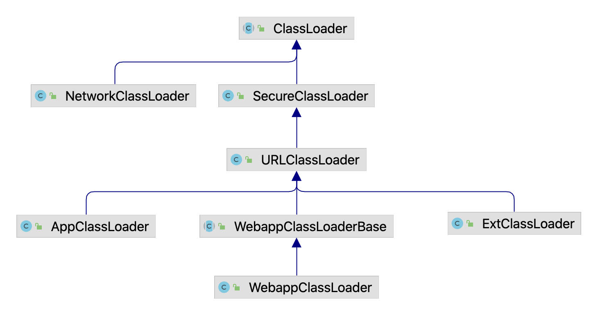

## 类加载器的实现类

ClassLoader是一个抽象类，它的实现类有很多，包括上一节中自定义的NetworkClassLoader，
jdk自带的URLClassLoader、AppClassLoader、ExtClassLoader等(jdk9以上类加载器实现有差异)。
一般我们只需要重写ClassLoader的findClass方法获取需要加载的类的字节码，
然后调用defineClass方法生成Class对象。
如果想要在类加载到JVM中时就被链接，可以调用resolveClass方法，也可以选择交给JVM在类初始化时链接。

（提供绘图的源码）



### URLClassLoader

URLClassLoader是ClassLoader的一个重要子类，它用于Jar文件和目录的URL的搜索路径加载类和资源。
它重写了findClass方法，findClass方法的作用就是从指定的url中去尝试加载类。
也就是说，通过URLClassLoader就可以加载指定jar中的class到内存中。
而class文件一般以jar包形式存在，因此使用URLClassLoader可以完成绝大多数场景的类和资源加载。

URLClassLoader的构造器参数是资源路径和父类加载器，构造器中主要是初始化URLClassPath对象。
```java
public URLClassLoader(URL[] urls, ClassLoader parent) {
    super(parent);
    // this is to make the stack depth consistent with 1.1
    // ... 权限检查代码省略
    this.acc = AccessController.getContext();
    ucp = new URLClassPath(urls, acc);
}
```

下面是findClass的实现。
```java
protected Class<?> findClass(final String name) throws ClassNotFoundException {
    // 1、将类的全限定名变成.class文件路径的方式
    String path = name.replace('.', '/').concat(".class");
    // 2、在url中查找是否存在
    Resource res = ucp.getResource(path, false);
    // ... 异常处理忽略
    return defineClass(name, res);
}
```

findClass方法的执行逻辑主要分为三步：

1、将类的全限定名变成.class文件路径的方式

2、在url中查找文件是否存在

3、调用defineClass

### jetty类加载器

前面介绍了java中类加载的一般模型：双亲委派模型，这个模型适用于大多数类加载的场景，
但对于web容器却是不适用的；这是因为servlet规范对web容器的类加载做了一些规定，简单的来说有以下几条：

1.WEB-INF/classes和WEB-INF/lib路径下的类会优先于父容器中的类加载，
比如WEB-INF/classes下有个ClassA类，
CLASSPATH下也有个ClassA类，jetty会优先加载WEB-INF/classes下的，这与双亲委托模型下的加载行为相反。

2.JVM系统基本类如java.lang.*下面的系统基本类等不遵循第一条， 
即WEB-INF/classes或WEB-INF/lib中的类不能替换系统基本类。
对于哪些是系统类，其实没有做出具体规定，jetty中是通过枚举了一些类来进行判断的。

3.web容器自身的类不能被应用类引用，即web容器自身的类不能被应用类加载器加载。
jetty中通过设置类加载名单来屏蔽应用类加载器对jetty类的访问。


https://baijiahao.baidu.com/s?id=1600064255906644546&wfr=spider&for=pc


https://blog.csdn.net/chen_fly2011/article/details/56016338


为了实现上面的三个要求并实现不同部署应用间依赖的隔离，jetty定义了自己的类加载器WebAppClassLoader，
通过对这个类加载器使用线程上下文加载模式来达到目的。

这里以最新的以jetty-10.0.x的源码来说明。


代码位置：jetty-webapp/src/main/java/org/eclipse/jetty/webapp/WebAppClassLoader.java

WebAppClassLoader的属性：
```java
    private final Context _context;     // 类加载器上下文
    private final ClassLoader _parent;  // 父加载器
    private final Set<String> _extensions = new HashSet<String>(); // 加载文件的后缀
    private String _name = String.valueOf(hashCode()); // 加载器名称
    private final List<ClassFileTransformer> _transformers = new CopyOnWriteArrayList<>(); // 类加载之前转换器
```
先来看下WebAppContext，记录了应用的上下文和配置信息

代码位置：jetty-webapp/src/main/java/org/eclipse/jetty/webapp/WebAppContext.java


Jetty规定的系统类和jetty自身的基础类如下，如果是这些类将不使用WebAppClassLoader加载
```java
    // JDK的系统类不能被webapplication classloader 替代
    // 必须使用webapplication classloader 加载
    public static final ClassMatcher __dftSystemClasses = new ClassMatcher(
        "java.",
        "javax.",
        "org.xml.",
        "org.w3c."
    );

    // 以"org.eclipse.jetty."开头的类是Jetty服务自身的类
    // 不被webapplication classloader加载
    public static final ClassMatcher __dftServerClasses = new ClassMatcher(
        "org.eclipse.jetty."                // hide jetty classes
    );

```

判断是否是parent优先模式由WebAppContext中的一段来解决：
```java
    // _parentLoaderPriority 父加载器优先配置项
    private boolean _parentLoaderPriority = Boolean.getBoolean("org.eclipse.jetty.server.webapp.parentLoaderPriority");

    // 是否是父加载器优先，默认为false
    // 类必须从 WEB-INF/lib or WEB-INF/classe 优先加载
    @Override
    @ManagedAttribute(value = "parent classloader given priority", readonly = true)
    public boolean isParentLoaderPriority(){
        return _parentLoaderPriority;
    }
```

WebAppClassLoader的构造函数如下：
```java    
    public WebAppClassLoader(ClassLoader parent, Context context)
        throws IOException {
        super(new URL[]{}, parent != null ? parent
            : (Thread.currentThread().getContextClassLoader() != null ? Thread.currentThread().getContextClassLoader()
            : (WebAppClassLoader.class.getClassLoader() != null ? WebAppClassLoader.class.getClassLoader()
            : ClassLoader.getSystemClassLoader())));
            
        _parent = getParent(); 
        _context = context; // web上下文
        if (_parent == null)
            throw new IllegalArgumentException("no parent classloader!");
        
        // 类加载器可以加载的文件类型：jar或者zip包    
        _extensions.add(".jar");
        _extensions.add(".zip");
         
        // 增加classpath
        if (context.getExtraClasspath() != null){
            for (Resource resource : context.getExtraClasspath()){
                addClassPath(resource);
            }
        }
    }
```
先来看下设置父加载器的优先级，指定的父加载器、线程上下文加载器、WebAppClassLoader类的加载器、JDK的系统类加载器。


在看下loadClass方法的实现：
```java
    @Override
    protected Class<?> loadClass(String name, boolean resolve) throws ClassNotFoundExceptio {
        synchronized (getClassLoadingLock(name)) {

            // STEP1: 先从WebAppClassLoader类加载器的缓存中查找类
            webappClass = findLoadedClass(name);
            if (webappClass != null){
                return webappClass;
            }
            
            if (_context.isParentLoaderPriority()) {
                // STEP2: 是否开启父类加载器优先加载的配置项，默认为false
        
                // 从父类加载加载
                parentClass = _parent.loadClass(name);
                
                // ... 加载失败，继续往下执行
        
                // 从WebAppClassLoader类加载器的路径下查找类
                webappClass = this.findClass(name);
                if (resolve)
                    resolveClass(webappClass);
                return webappClass;
                
            } else {
                
                // STEP3: 先从WebAppClassLoader加载
                webappClass = loadAsResource(name, true);
                if (webappClass != null) {
                    return webappClass;
                }

                // ... 加载失败，继续往下执行
        
                // WebAppClassLoader加载失败，调用其父类加载器加载
                parentClass = _parent.loadClass(name);
                
                // ...
            }
        }
    }
```

从实现可以看到，isParentLoaderPriority方法决定了是否采用父加载器优先，默认为false，
即当收到类加载请求时默认从WebAppClassLoader的类路径下加载。


### tomcat


### springboot


类加载器对比：

https://blog.csdn.net/talentkep/article/details/83771166?spm=1001.2101.3001.6650.5&utm_medium=distribute.pc_relevant.none-task-blog-2%7Edefault%7EBlogCommendFromBaidu%7ERate-5-83771166-blog-79253048.235%5Ev38%5Epc_relevant_anti_t3&depth_1-utm_source=distribute.pc_relevant.none-task-blog-2%7Edefault%7EBlogCommendFromBaidu%7ERate-5-83771166-blog-79253048.235%5Ev38%5Epc_relevant_anti_t3