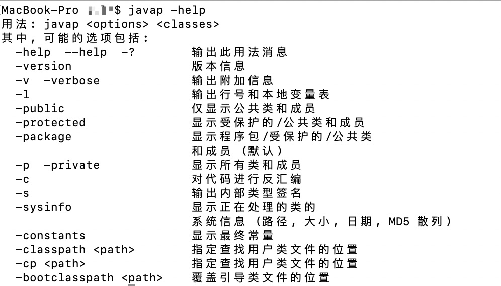

## 2.2 class文件反编译

### 2.2.1 javap工具

javap是Java class文件分解器，可以反编译，也可以查看java编译器生成的字节码等。javap的帮助手册。

> 图2-100 javap的帮助手册



+ 不加任何参数
```java
~ javap Foo
Compiled from "Foo.java"
public class Foo {
public Foo();
public static void main(java.lang.String[]);
}
```
默认情况下，javap会显示访问权限为public、protected和默认级别的方法。
如果想要显示private方法和字段，使用-p选项。
+ -s选项
```java
~ javap -s Foo
Compiled from "Foo.java"
public class Foo {
public Foo();
descriptor: ()V

public static void main(java.lang.String[]);
descriptor: ([Ljava/lang/String;)V
}
```
输出类型描述符签名信息
+ -c选项

+ -l选项

+ -v选项

可以显示详尽的类信息，包括版本号、访问标识、常量池、方法描述等信息，是使用最频繁的选项。
下面详细介绍 -v选项输出的信息。下面对各个部分逐一介绍。
1）class文件的编译和版本信息


2）class文件的常量池
常量池中的每一项都有一个对应的索引（如#1），并且可能引用其他的常量池项（#1=Methodref #6.#20）


> 图2-9 Code属性的常量池部分

3）class文件的方法信息


> 图2-10Code属性的方法部分

### 2.2.2 jclasslib工具

jclasslib字节码编辑器是一个可以可视化class类文件和修改字节码的工具。jclasslib 主界面如下图2-11。

> 图2-11 jclasslib主界面

+ 编辑常量池

> 图2-12 jclasslib编辑常量池

+ 编辑操作指令

> 图2-13 jclasslib编辑字节码指令

该工具还提供了IDEA 插件。在IDEA Plugins中搜索jclasslib 执行安装即可，如图2-14。

> 图2-14 安装jclasslib的IDEA插件

使用效果如图所示，代码编译后在菜单栏"View"中选择"Show Bytecode With jclasslib"，可以很直观地看到当前字节码文件的类信息、常量池、方法区等信息。

> 图2-15 IDEA插件的使用

