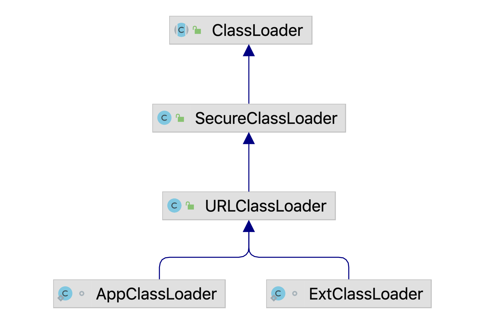

## 4.3 JDK的类加载器

JDK自身的jar包如rt.jar和tools.jar（或者JDK9以上的模块）等中的类也需要使用类加载器来加载，下面的代码用来获取JDK内置的类加载器。
```java
public class JdkClassloader {
    public static void main(String[] args) {
        // 获取系统类加载器
        ClassLoader systemClassLoader = ClassLoader.getSystemClassLoader();
        System.out.println(systemClassLoader);
        
        // 获取系统类加载器的父类加载器 --> 扩展类加载器或者平台类加载器
        ClassLoader platformClassLoader = systemClassLoader.getParent();
        System.out.println(platformClassLoader);
        
        // 获取扩展类加载器的父类加载器 --> 启动类加载器（C/C++）
        ClassLoader bootstrapClassLoader = platformClassLoader.getParent();
        System.out.println(bootstrapClassLoader);
    }
}
```

在JDK8上运行：
```
sun.misc.Launcher$AppClassLoader@18b4aac2
sun.misc.Launcher$ExtClassLoader@4a574795
null
```

在JDK11上运行：
```
jdk.internal.loader.ClassLoaders$AppClassLoader@512ddf17
jdk.internal.loader.ClassLoaders$PlatformClassLoader@3cda1055
null
```
可以看到JDK8和JDK11类加载器的类名称存在差异，下面分别说明其实现。

### 4.3.1 JDK8的类加载器

#### 4.3.1.1 AppClassloader
AppClassloader也称为System ClassLoader，继承了URLClassLoader，
是Java虚拟机默认的类加载器之一，主要用来加载用户类和第三方依赖包，
在JVM启动命令行中设置`-Djava.class.path`参数来指定加载路径。
> 代码位置：src/share/classes/sun/misc/Launcher$AppClassLoader.java
```java
// AppClassLoader继承URLClassLoader
static class AppClassLoader extends URLClassLoader {
    
    public static ClassLoader getAppClassLoader(final ClassLoader extcl)
            throws IOException {
        // 搜索路径java.class.path
        final String s = System.getProperty("java.class.path");
        final File[] path = (s == null) ? new File[0] : getClassPath(s);

        URL[] urls = (s == null) ? new URL[0] : pathToURLs(path);
        return new AppClassLoader(urls, extcl);
    }

    /*
     * Creates a new AppClassLoader
     */
    AppClassLoader(URL[] urls, ClassLoader parent) {
        super(urls, parent, factory);
    }

    /**
     * 重写了loadClass，支持类的包权限检查
     */
    public Class<?> loadClass(String name, boolean resolve)
            throws ClassNotFoundException {
        int i = name.lastIndexOf('.');
        if (i != -1) {
            SecurityManager sm = System.getSecurityManager();
            if (sm != null) {
                sm.checkPackageAccess(name.substring(0, i));
            }
        }
        // 调用父类URLClassLoader完成类加载
        return (super.loadClass(name, resolve));
    }
    
    // 其他方法省略...
}    
```

#### 4.3.1.2 ExtClassLoader

ExtClassLoader称为扩展类加载器，继承了URLClassLoader，主要负责加载Java的扩展类库，默认加载${JAVA_HOME}/jre/lib/ext/
目录下的所有jar包，也可以用参数`-Djava.ext.dirs`来设置它的搜索路径。
> 代码位置：src/share/classes/sun/misc/Launcher$ExtClassLoader.java
```java
// ExtClassLoader继承URLClassLoader
static class ExtClassLoader extends URLClassLoader {

    public static ExtClassLoader getExtClassLoader() throws IOException {
        final File[] dirs = getExtDirs();

        try {
            return new ExtClassLoader(dirs);
        } catch (java.security.PrivilegedActionException e) {
            throw (IOException) e.getException();
        }
    }
    
    public ExtClassLoader(File[] dirs) throws IOException {
        super(getExtURLs(dirs), null, factory);
    }

    private static File[] getExtDirs() {
        // 通过系统变量指定加载路径
        String s = System.getProperty("java.ext.dirs");
        File[] dirs;
        if (s != null) {
            StringTokenizer st =
                    new StringTokenizer(s, File.pathSeparator);
            int count = st.countTokens();
            dirs = new File[count];
            for (int i = 0; i < count; i++) {
                dirs[i] = new File(st.nextToken());
            }
        } else {
            dirs = new File[0];
        }
        return dirs;
    }
}    
```

JDK8的类加载器的继承关系如下图4-3所示：

> 图4-3 JDK8的类加载器的继承关系



#### 4.3.1.3 JDK8的类加载器的初始化
JDK的类加载器的初始化在Launcher类中。

> 源码位置：src/share/classes/sun/misc/Launcher.java

```java
public class Launcher {

    public Launcher() {
        // 创建ExtClassLoader
        ClassLoader extcl = ExtClassLoader.getExtClassLoader();
        // 创建AppClassLoader
        ClassLoader loader = AppClassLoader.getAppClassLoader(extcl);
        // 设置当前线程的ContextClassLoader
        Thread.currentThread().setContextClassLoader(loader);
        // 异常处理的代码省略
    }
    // ...
}    
```
可以看到，初始化过程较为简单，先初始化ExtClassLoader，然后在初始化AppClassLoader，并且设置AppClassLoader的父加载器为ExtClassLoader。

### 4.3.2 JDK11的类加载器

JDK9实现模块化之后，对Classloader有所改造，其中一点就是将ExtClassLoader改为PlatformClassLoader，
模块化之后不同的Classloader加载各自对应的模块。因为JDK11是一个长期支持的稳定版本，这里以JDK11的源代码来说明类加载器的变化。JDK11的类加载器的继承关系如下图4-4所示：

> 图4-4 JDK11的类加载器的继承关系


#### 4.3.2.1 BuiltinClassLoader

BuiltinClassLoader是PlatformClassLoader、BootClassLoader和AppClassloader的父类，功能上与URLClassLoader相似，都是基于UrlClassPath来实现类的查找，但BuiltinClassLoader还支持从模块中加载类。

BuiltinClassLoader的属性与构造函数如下：

> 代码位置：src/java.base/share/classes/jdk/internal/loader/BuiltinClassLoader.java

```java
// 类加载器路径
private final URLClassPath ucp;

BuiltinClassLoader(String name, BuiltinClassLoader parent, URLClassPath ucp) {
    // 确保当父加载器是bootloader时返回null
    // name 是类加载器的名称
    super(name, parent == null || parent == ClassLoaders.bootLoader() ? null : parent);

    this.parent = parent;
    this.ucp = ucp;
    
    this.nameToModule = new ConcurrentHashMap<>();
    this.moduleToReader = new ConcurrentHashMap<>();
}
```

BuiltinClassLoader也重写了loadClass方法，loadClass实际调用loadClassOrNull方法，来看下loadClassOrNull方法的实现。

> 源码位置：src/java.base/share/classes/jdk/internal/loader/BuiltinClassLoader.java
```java
protected Class<?> loadClassOrNull(String cn, boolean resolve) {
    // 加锁，保证线程安全
    synchronized (getClassLoadingLock(cn)) {
        // 先去找一次class是否已经被加载了，此方法是ClassLoader中的native方法
        Class<?> c = findLoadedClass(cn);
        if (c == null) {
            // 这里会需要去先加载模块信息
            LoadedModule loadedModule = findLoadedModule(cn);
            if (loadedModule != null) {
                BuiltinClassLoader loader = loadedModule.loader();
                if (loader == this) {
                    if (VM.isModuleSystemInited()) {
                        c = findClassInModuleOrNull(loadedModule, cn);
                    }
                } else {
                    // 委托其他类加载器加载
                    c = loader.loadClassOrNull(cn);
                }
            } else {
                // 先调用父加载器的相关方法去加载一次
                if (parent != null) {
                    c = parent.loadClassOrNull(cn);
                }

                // 如果没加载到，则用当前加载器去加载
                if (c == null && hasClassPath() && VM.isModuleSystemInited()) {
                    // 此方法内会调用到defineClas方法完成类的定义
                    c = findClassOnClassPathOrNull(cn);
                }
            }

        }

        if (resolve && c != null)
            resolveClass(c);

        return c;
    }
}
```
和通常的双亲委派稍有差异，如果一个class属于某个module那么会直接调用该module的类加载器去加载，
而不是说直接用当前类加载器的双亲委派模型去加载。 但是找到这个class对应的类加载器后，还是会按照双亲委派去加载。

BuiltinClassLoader也重写了ClassLoader的findClass方法。

> 源码位置：src/java.base/share/classes/jdk/internal/loader/BuiltinClassLoader.java

```java
@Override
protected Class<?> findClass(String cn) throws ClassNotFoundException {
    
    // 在模块中尝试查找
    LoadedModule loadedModule = findLoadedModule(cn);

    Class<?> c = null;
    if (loadedModule != null) {
        //  加载任务委派给模块的加载器
        if (loadedModule.loader() == this) {
            c = findClassInModuleOrNull(loadedModule, cn);
        }
    } else {
        // 类路径下查找
        if (hasClassPath()) {
            c = findClassOnClassPathOrNull(cn);
        }
    }

    // 都没有找到，抛出异常
    if (c == null)
        throw new ClassNotFoundException(cn);

    return c;
}
```
其中findClassOnClassPathOrNull是在类路径下查找类。

> 源码位置：src/java.base/share/classes/jdk/internal/loader/BuiltinClassLoader.java

```java
private Class<?> findClassOnClassPathOrNull(String cn) {
    String path = cn.replace('.', '/').concat(".class");
    // 权限检查代码省去...
    Resource res = ucp.getResource(path, false);
    if (res != null) {
        try {
          return defineClass(cn, res);
       } catch (IOException ioe) {
        // TBD on how I/O errors should be propagated
       }
    }
    return null;
}
```

##### 4.3.2.2 BuiltinClassLoader的子类以及初始化

ClassLoaders类中分别初始化BootClassLoader、PlatformClassLoader和AppClassLoader类加载器。

> 源码位置：src/java.base/share/classes/jdk/internal/loader/ClassLoaders.java

```java
public class ClassLoaders {

    // JDK内置类加载器
    private static final BootClassLoader BOOT_LOADER;
    private static final PlatformClassLoader PLATFORM_LOADER;
    private static final AppClassLoader APP_LOADER;

    // 初始化类加载器对象
    static {
        // 可以使用 -Xbootclasspath/a 或者 -javaagent 中的Boot-Class-Path属性指定
        String append = VM.getSavedProperty("jdk.boot.class.path.append");
        // 初始化BOOT_LOADER
        BOOT_LOADER =
            new BootClassLoader((append != null && append.length() > 0)
                ? new URLClassPath(append, true)
                : null);
        
        // 初始化PLATFORM_LOADER并指定AppClassLoader的父加载器BOOT_LOADER        
        PLATFORM_LOADER = new PlatformClassLoader(BOOT_LOADER);

        // 获取classpath路径
        String cp = System.getProperty("java.class.path");
        if (cp == null || cp.length() == 0) {
            String initialModuleName = System.getProperty("jdk.module.main");
            cp = (initialModuleName == null) ? "" : null;
        }
        URLClassPath ucp = new URLClassPath(cp, false);
        // 初始化APP_LOADER并指定AppClassLoader的父加载器为PLATFORM_LOADER
        APP_LOADER = new AppClassLoader(PLATFORM_LOADER, ucp);
    }
  
    // ...
 }   
```

从类加载器实例的初始化代码可以看出，BootClassLoader用来加载`jdk.boot.class.path.append`参数指定的类，在初始化PLATFORM_LOADER是指定BOOT_LOADER为其父类，在初始化AppClassLoader是指定PLATFORM_LOADER为其父类，构成了类加载器的三层结构。

再来看下JDK9以上特有的PlatformClassLoader类：

```java
private static class PlatformClassLoader extends BuiltinClassLoader {
    
    PlatformClassLoader(BootClassLoader parent) {
        // 类加载器名称为platform
        super("platform", parent, null);
    }
    
    // ...
}
```

不同类加载器负责加载对应的模块，在编译JDK时指定。
> 代码来源：jdk11-1ddf9a99e4ad/make/common/Modules.gmk

+ BOOT_MODULES是由引导加载程序定义的模块：
```text
java.base               java.datatransfer
java.desktop            java.instrument
java.logging            java.management
java.management.rmi     java.naming
java.prefs              java.rmi
java.security.sasl      java.xml
jdk.internal.vm.ci      jdk.jfr
jdk.management          jdk.management.jfr
jdk.management.agent    jdk.net
jdk.sctp                jdk.unsupported
jdk.naming.rmi
```
+ PLATFORM_MODULES是由平台加载程序定义的模块：
```text
java.net.http           java.scripting  
java.security.jgss      java.smartcardio    
java.sql                java.sql.rowset
java.transaction.xa     java.xml.crypto
jdk.accessibility       jdk.charsets
jdk.crypto.cryptoki     jdk.crypto.ec
jdk.dynalink            jdk.httpserver
jdk.jsobject            jdk.localedata
jdk.naming.dns          jdk.scripting.nashorn
jdk.security.auth       jdk.security.jgss
jdk.xml.dom             jdk.zipfs
jdk.crypto.mscapi       jdk.crypto.ucrypto
java.compiler           jdk.aot
jdk.internal.vm.compiler
jdk.internal.vm.compiler.management
java.se
```

+ JRE_TOOL_MODULES是JRE中包含的工具，由AppClassLoader加载：
```java
jdk.jdwp.agent
jdk.pack
jdk.scripting.nashorn.shell
```
未列出的其他模块由AppClassLoader加载。