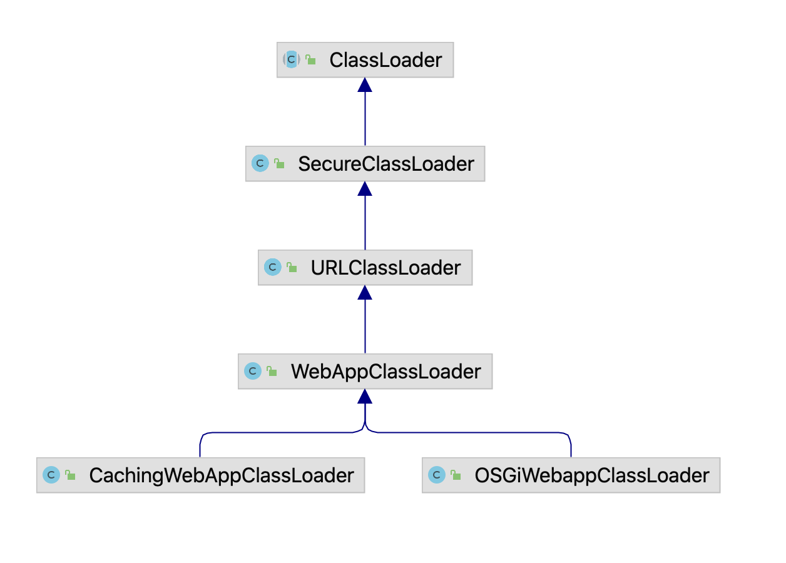
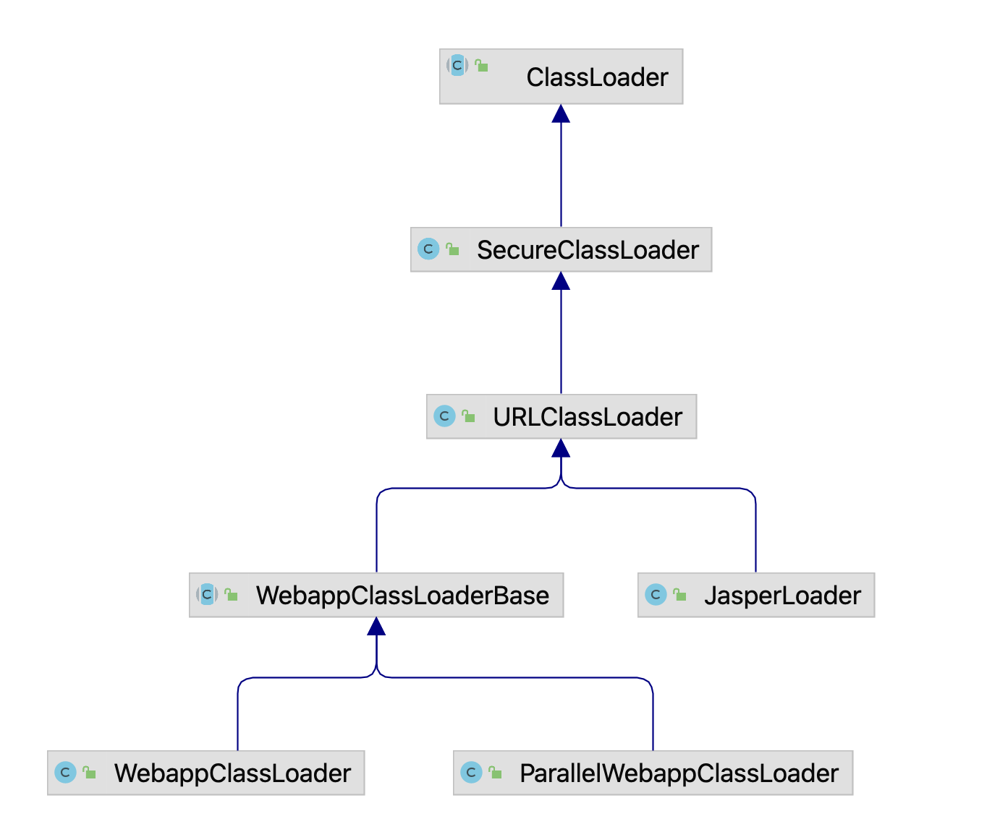

## 4.4 Web容器的加载器

前面介绍了Java中类加载的一般模型：双亲委派模型，这个模型适用于大多数类加载的场景，但对于web容器却是不适用的。这是因为servlet规范对web容器的类加载做了一些规定，简单的来说有以下几条：

+ WEB-INF/classes和WEB-INF/lib路径下的类会优先于父容器中的类加载。比如WEB-INF/classes下有个Foo类，
  CLASSPATH下也有个Foo类，web容器加载器会优先加载位于WEB-INF/classes下的类，这与双亲委托模型的加载行为相反。
+ java.lang.Object等系统类不遵循第一条。WEB-INF/classes或WEB-INF/lib中的类不能替换系统类。对于哪些是系统类，
  其实没有做出具体规定，web容器通常是通过枚举了一些类来进行判断的。
+ web容器的自身的实现类不被应用中的类引用，即web容器的实现类不能被任何应用类加载器加载。对于哪些是web容器的类也是通过枚举包名称来进行判断。

### 4.4.1 Jetty类加载器

为了实现上面的三个要求并实现不同部署应用间依赖的隔离，Jetty定义了自己的类加载器WebAppClassLoader，类加载器的继承关系如下：
> 图4-5 Jetty类加载器的继承关系


WebAppClassLoader的属性如下：
```java
// 类加载器上下文
private final Context _context;     
// 父加载器
private final ClassLoader _parent;  
// 加载文件的后缀 .zip或者.jar
private final Set<String> _extensions = new HashSet<String>(); 
// 加载器名称
private String _name = String.valueOf(hashCode()); 
// 类加载之前转换器
private final List<ClassFileTransformer> _transformers = new CopyOnWriteArrayList<>(); 
```

当类的package路径名位包含于以下路径时，会被认为是系统类。系统类是对应用类可见。
```java
// 系统类不能被应用jar包中的类替换，并且只能被system classloader加载
public static final ClassMatcher __dftSystemClasses = new ClassMatcher(
    "java.","javax.","org.xml.","org.w3c."
);
```

Server类不对任何应用可见，Jetty同样是用package路径名来区分哪些是Server类。WebAppContext中配置如下：
```java
// 使用system classloader加载，并且对web application不可见    
public static final ClassMatcher __dftServerClasses = new ClassMatcher(
    "org.eclipse.jetty."
);
```

我们可以通过WebAppContext.addServerClasses或 WebAppContext.addServerClassMatcher方法设置 Server 类。 需要注意的是，Server 类是对所有应用都不可见，但是 WEB-INF/lib 下的应用类可以替换 Server 类。

> 代码位置：jetty-webapp/src/main/java/org/eclipse/jetty/webapp/WebAppContext.java

```java
public static void addServerClasses(Server server, String... pattern) {
    addClasses(__dftServerClasses, SERVER_SRV_CLASSES, server, pattern);
}       

public static void addSystemClasses(Server server, String... pattern) {
    addClasses(__dftSystemClasses, SERVER_SYS_CLASSES, server, pattern);
}  

public void addServerClassMatcher(ClassMatcher serverClasses) {
    _serverClasses.add(serverClasses.getPatterns());
}        

public void addSystemClassMatcher(ClassMatcher systemClasses) {
    _systemClasses.add(systemClasses.getPatterns());
}                                                            
```

WebAppClassLoader的构造函数如下：
```java
public WebAppClassLoader(ClassLoader parent, Context context) 
        throws IOException {
    // 指定父加载器
    super(new URL[]{}, parent != null ? parent
            : (Thread.currentThread().getContextClassLoader() != null ? Thread.currentThread().getContextClassLoader()
            : (WebAppClassLoader.class.getClassLoader() != null ? WebAppClassLoader.class.getClassLoader()
            : ClassLoader.getSystemClassLoader())));
    _parent = getParent();
    _context = context;
    if (_parent == null)
        throw new IllegalArgumentException("no parent classloader!");
    
    // 类加载器可以加载的文件类型：jar或者zip包 
    _extensions.add(".jar");
    _extensions.add(".zip");
}                                                                                                                     
```
构造函数可以显示指定父类加载器，默认情况下为空，即将当前的线程上下文classLoader指定为当前的parent，
而这个线程上下文classLoader如果没有用户指定的话默认又将是前面提到过的System ClassLoader。

再看下loadClass方法。
```java
@Override                                                                                                  
protected Class<?> loadClass(String name, boolean resolve) throws ClassNotFoundException {                 
    synchronized (getClassLoadingLock(name)) {
        ClassNotFoundException ex = null;
        Class<?> parentClass = null; // 来源于父加载器
        Class<?> webappClass = null; // 来源于webapp加载器

        // 先从已经加载的类中查找
        webappClass = findLoadedClass(name);
        if (webappClass != null) {
            return webappClass;
        }

        // 先尝试从当前类加载器加载（这里true表示检查类是否是系统类，如果不是，返回加载的类）
        webappClass = loadAsResource(name, true);
        if (webappClass != null) {
            return webappClass;
        }

        // 然后尝试当前类加载器的父加载器加载
        try {
            parentClass = _parent.loadClass(name);
            // 判断是否允许加载server类，或者当前类不是 server 类
            if (Boolean.TRUE.equals(__loadServerClasses.get()) 
                    || !_context.isServerClass(parentClass)) {
                return parentClass;
            }
        } catch (ClassNotFoundException e) {
            ex = e;
        }
        
        // 尝试从当前类加载器加载（这里false表示不检查类是否是系统类）
        webappClass = loadAsResource(name, false); 
        if (webappClass != null) {
            return webappClass;
        }
        throw ex == null ? new ClassNotFoundException(name) : ex;
    }
}                                                                                                          
```

### 4.4.2 Tomcat类加载器
与Jetty容器一样，Tomcat也需要遵循servlet三条规范。Tomcat的类加载器的继承关系如下：

> 图4-6 Tomcat类加载器的继承关系



#### WebappClassLoader
> 代码来源：apache-tomcat-10.1.13-src/java/org/apache/catalina/loader/WebappLoader.java
```java
public class WebappClassLoader extends WebappClassLoaderBase {
    public WebappClassLoader() {
        super();
    }
    public WebappClassLoader(ClassLoader parent) {
        super(parent);
    } 
    
    //...
}
```

WebappClassLoader继承WebappClassLoaderBase，类加载的功能主要在WebappClassLoaderBase中实现。看下代码：
> 代码来源：apache-tomcat-10.1.13-src/java/org/apache/catalina/loader/WebappClassLoaderBase.java

先来看下构造函数：
```java

protected boolean delegate = false;

// 加载JavaSE的类加载器
private ClassLoader javaseClassLoader;

// 当前类加载器的父加载器
protected final ClassLoader parent;

protected WebappClassLoaderBase() {

    super(new URL[0]);
    // 初始化没有指定父加载器，则父加载器为系统类加载器
    ClassLoader p = getParent();
    if (p == null) {
        p = getSystemClassLoader();
    }
    this.parent = p;

    // 初始化javaseClassLoader为平台类加载器或者扩展类加载器
    ClassLoader j = String.class.getClassLoader();
    if (j == null) {
        j = getSystemClassLoader();
        while (j.getParent() != null) {
            j = j.getParent();
        }
    }
    this.javaseClassLoader = j;

    securityManager = System.getSecurityManager();
    if (securityManager != null) {
        refreshPolicy();
    }
}
```
再来看下重写的loadClass方法。
```java
public abstract class WebappClassLoaderBase extends URLClassLoader
        implements Lifecycle, InstrumentableClassLoader, WebappProperties, PermissionCheck {
	// ...	省略不需要关注的代码
    protected WebappClassLoaderBase() {

        super(new URL[0]);
		// 获取当前WebappClassLoader的父加载器
        ClassLoader p = getParent();
        if (p == null) {
            p = getSystemClassLoader();
        }
        this.parent = p;
		
        // 设置javaseClassLoader为平台类加载器或者扩展类加载器
        ClassLoader j = String.class.getClassLoader();
        if (j == null) {
            j = getSystemClassLoader();
            while (j.getParent() != null) {
                j = j.getParent();
            }
        }
        this.javaseClassLoader = j;

        // 权限代码省战略...
    }

    // 省略不需要关注的代码...
    
    @Override
    public Class<?> loadClass(String name, boolean resolve) throws ClassNotFoundException {

        synchronized (getClassLoadingLock(name)) {
            
            Class<?> clazz = null;

			// 本地类缓存中查找
            clazz = findLoadedClass0(name);
            if (clazz != null) {
                return clazz;
            }

            // Web应用程序本地类缓存中没有，可以从系统类加载器缓存中查找，
            // 如果找到说明AppClassLoader之前已经加载过这个类
            clazz = findLoadedClass(name);
            if (clazz != null) {
                return clazz;
            }

			// 将类似java.lang.String这样的类名这样转换成java/lang/String
            String resourceName = binaryNameToPath(name, false);
			// 获取引导类加载器（BootstrapClassLoader）
            ClassLoader javaseLoader = getJavaseClassLoader();
            boolean tryLoadingFromJavaseLoader;
            try {
		        // 引导类加载器根据转换后的类名获取资源url，如果url不为空，就说明找到要加载的类
                URL url;
                if (securityManager != null) {
                    PrivilegedAction<URL> dp = new PrivilegedJavaseGetResource(resourceName);
                    url = AccessController.doPrivileged(dp);
                } else {
                    url = javaseLoader.getResource(resourceName);
                }
                tryLoadingFromJavaseLoader = (url != null);
            } catch (Throwable t) {
                ExceptionUtils.handleThrowable(t);
                tryLoadingFromJavaseLoader = true;
            }

           // 首先，从扩展类加载器（ExtClassLoader）加载
           if (tryLoadingFromJavaseLoader) {
               return javaseLoader.loadClass(name);
            }
            
            //   delegate允许类委托给父类加载
            boolean delegateLoad = delegate || filter(name, true);
            
            if (delegateLoad) {
                return Class.forName(name, false, parent);
            }

            // 在当前web路径加载
            return clazz = findClass(name);

            // 经过上面几个步骤还未加载到类，则采用系统类加载器（也称应用程序类加载器）进行加载
            if (!delegateLoad) {
               return Class.forName(name, false, parent);
            }
        }
        // 最终，还未加载到类，报类未找到的异常
        throw new ClassNotFoundException(name);
    }
	// ...
}
```

#### 4.2.2.2 JSP类加载器 (TODO: 不全)

```java
public class JasperLoader extends URLClassLoader {
    
    @Override
    public synchronized Class<?> loadClass(final String name, boolean resolve)
        throws ClassNotFoundException {

        Class<?> clazz = null;

        // 从JVM的类缓存中查找
        clazz = findLoadedClass(name);
        if (clazz != null) {
            if (resolve) {
                resolveClass(clazz);
            }
            return clazz;
        }
        
        // ...
      
        // 如果类名不是以org.apache.jsp包名开头的，则采用WebappClassLoader加载
        if( !name.startsWith(Constants.JSP_PACKAGE_NAME + '.') ) {
            // Class is not in org.apache.jsp, therefore, have our
            // parent load it
            clazz = getParent().loadClass(name);
            if( resolve ) {
                resolveClass(clazz);
            }
            return clazz;
        }
        
        // 如果是org.apache.jsp包名开头JSP类，就调用父类URLClassLoader的findClass方法
        // 动态加载类文件，解析成Class类，返回给调用方
        return findClass(name);
    }
}

```
从源码中我们可以看到，JSP类加载原理是先从JVM类缓存中（也就是Bootstrap类加载器加载的类）加载，
如果不是核心类库的类，就从Web应用程序类加载器WebappClassLoader中加载，如果还未找到，
就说明是JSP类，则通过动态解析JSP类文件获得要加载的类。
