## 10.1 SpEL使用与源码解析

熟悉表达式的使用对于漏洞的检测是非常关键的，本节将详细介绍SpEL表达式的各种用法并对源码进行分析。

### 10.1.1 基本语法与使用

+ 执行字符串表达式
```java
ExpressionParser parser = new SpelExpressionParser();
Expression exp = parser.parseExpression("'Hello World'"); 
String value = (String) exp.getValue();
```

+ 调用方法
```java
ExpressionParser parser = new SpelExpressionParser();
Expression exp = parser.parseExpression("'Hello World'.concat('!')"); 
String value = (String) exp.getValue();
```
+ 访问属性
```java
ExpressionParser parser = new SpelExpressionParser();
// invokes 'getBytes()'
Expression exp = parser.parseExpression("'Hello World'.bytes"); 
byte[] bytes = (byte[]) exp.getValue();
```

SpEL还通过使用标准点表示法（如prop1.prop2.prop3）和属性值的设置来支持嵌套属性。
也可以访问公共字段。以下示例显示了如何使用点表示法来获取文字的长度：
```java
ExpressionParser parser = new SpelExpressionParser();
// invokes 'getBytes().length'
Expression exp = parser.parseExpression("'Hello World'.bytes.length"); 
int length = (Integer) exp.getValue();
```
+ 调用构造函数

可以使用new运算符来调用构造函数。除了基元类型（int、float等）和String之外， 其他类型都应该使用完全限定类名。
java.lang包下的类可以使用短名称，如下例子：
```java
// 调用String类的构造器创建一个新的字符串并将其转换为大写
ExpressionParser parser = new SpelExpressionParser();
Expression exp = parser.parseExpression("new String('hello world').toUpperCase()"); 
String value = exp.getValue(String.class);
```

使用完全限定类名创建对象，如下所示：
```java
ExpressionParser parser = new SpelExpressionParser();
Expression exp = parser.parseExpression("new java.lang.String('hello world').toUpperCase()");
String value = exp.getValue(String.class);
```

+ T运算符

还可以使用特殊的T运算符来指定java.lang.Class的实例。静态方法也可以通过使用此运算符来调用。
与创建对象一样，java.lang包下的类型的使用T()引用不需要完全限定名称，但所有其他类型引用都必须是完全限定名称。
以下示例说明如何使用T运算符：
```java
Class dateClass = parser.parseExpression("T(java.util.Date)").getValue(Class.class);

Class stringClass = parser.parseExpression("T(String)").getValue(Class.class);

boolean value = parser.parseExpression(
        "T(java.math.RoundingMode).CEILING < T(java.math.RoundingMode).FLOOR")
        .getValue(Boolean.class);
```

这里仅介绍几个在漏洞利用中使用频率较高的用法，完整的使用教程可以参考SpEL官方文档：
> 图10-1 SpEL官方文档

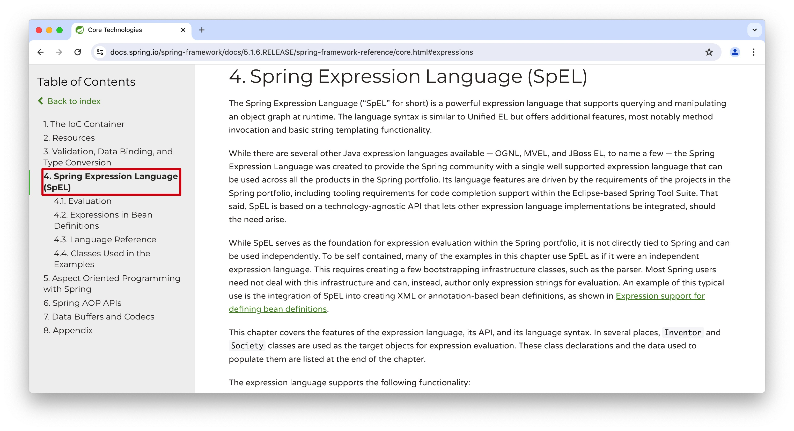

> SpEL官方文档：https://docs.spring.io/spring-framework/docs/5.1.6.RELEASE/spring-framework-reference/core.html#expressions

### 10.1.2 源码解析

#### 10.1.2.1 表达式解析为语法树
在了解其API的使用之后，应该深入分析其实现原理，这是选取合适Hook类的关键，因此源码分析是十分必要的。
本节将对SpEL表达式语法解析、编译和执行过程做一个Debug（代码以图片的形式展现）。

下面的代码执行一个简单的表达式，调用java.lang.Math类的静态方法random生成一个随机数并乘以100.0，然后获取表达式的值并输出。
> 图10-2 Debug的表达式代码


先对图10-2中的第1处的代码进行debug。进入到TemplateAwareExpressionParser的parseExpression方法。
> 图10-3 TemplateAwareExpressionParser的parseExpression方法


实际调用了SpelExpressionParser的doParseExpression方法。
> 图10-4 SpelExpressionParser的doParseExpression方法

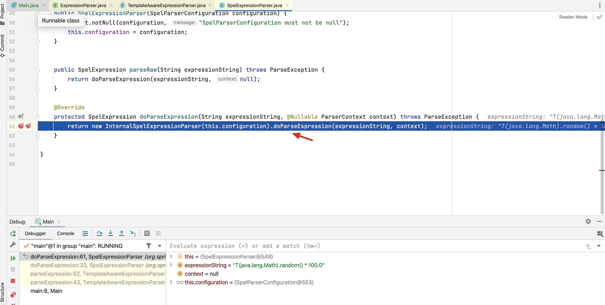

在doParseExpression方法中创建一个InternalSpelExpressionParser对象并调用doParseExpression方法。
> 图10-5 InternalSpelExpressionParser的doParseExpression方法

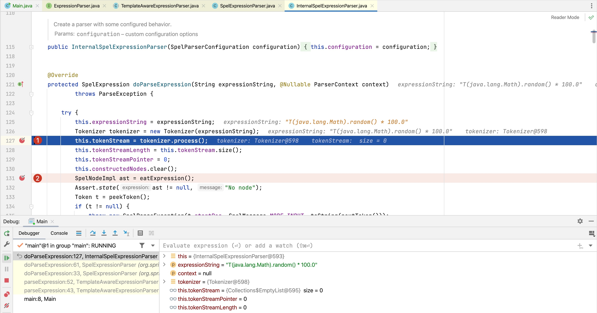

方法执行到此处才开始真正的表达式解析，ExpressionParser接口的UML类图如下图10-6所示。
> 图10-6 ExpressionParser接口的子类UML图

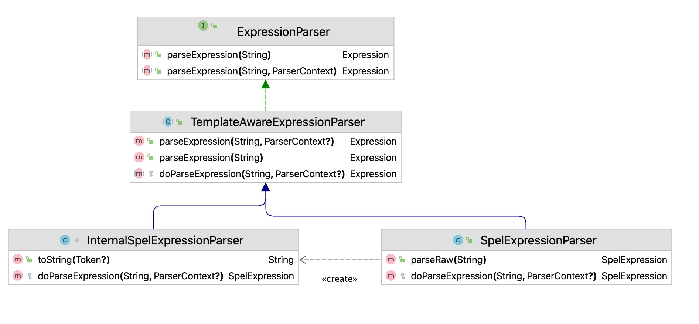

从图中可以看出，实际完成解析工作的方法都在InternalSpelExpressionParser中。其中`tokenizer.process()`这一步比较关键，
会解析出现的每一个字符，包括特殊字符如"("、")"、"*"和"."等。
> 图10-7 表达式中特殊字符解析

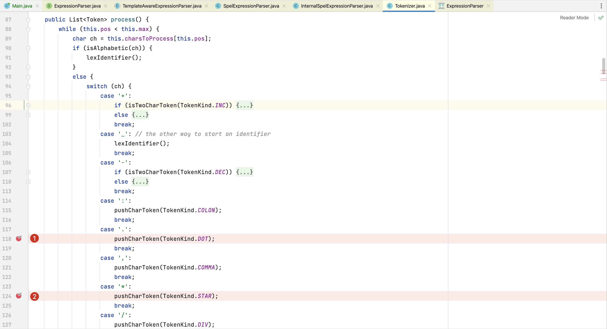

然后调用`eatExpression()`方法将表达式按照据逻辑符号拆分为基本运算单元，
常见的逻辑符号为：or、and、||、&&、+、-、*、/、++等。
本例子中表达式为乘法运算符号*，因此将返回一个OpMultiply对象。

> 图10-8 表达式按照逻辑运算符号拆分


最后生成AST语树如下图10-9所示。

>图10-9 生成AST语法树


表达式将分为如下2个表达式节点`T(java.lang.Math).random()` 和 `100.0`，2个表达式节点的的连接符号是"*"。

至此，字符串形式的表达式转化为一棵AST语法树，其结构如图10-10所示：
> 图10-10 AST语法树结构

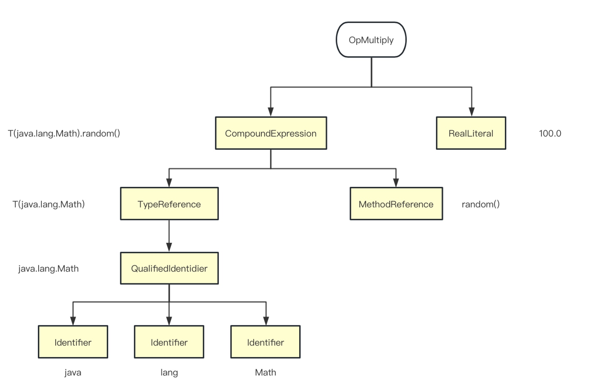


#### 10.1.2.2 表达式计算

在上一小节中，我们得到了表达式的AST语法树，本节将对AST语法树求值。
AST语法树的root节点是一个乘法操作OpMultiply对象，来看下他的代码。

> 图10-11 OpMultiply求值

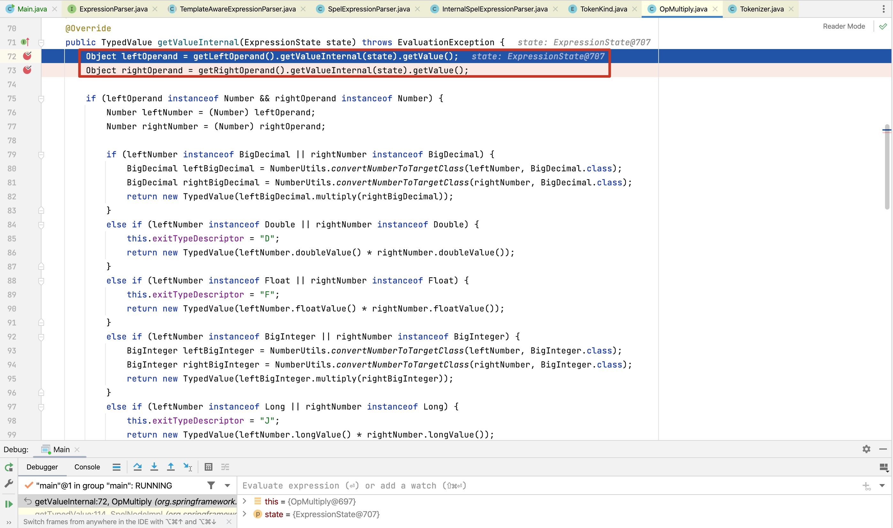

分别计算乘法左右两边表达式的值，然后就可以计算乘法表达式的最终值。
本例子中的右边是一个数字字符串，其值只需要将字符串转为double类型即可。
而左边是一个包含T运算的复合表达式，继续跟进左边表达式的计算方法中。

复合表达式又可以拆分为2部分：T(java.lang.Math)和 random()，复合表达式的运算符号是"."。

第一部分是T(java.lang.Math)，是一个TypeReference类型的节点，其计算过程如下：
> 图10-12 TypeReference类型值的计算

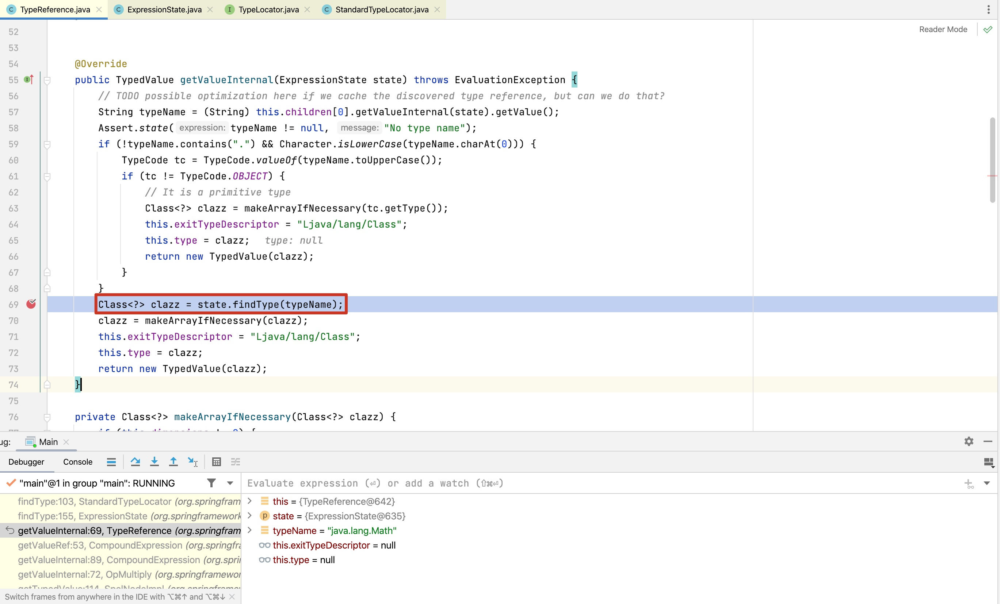
可以看出T运算符号用来获取类型的java.lang.Class对象。

加载指定的类获取Class对象，这个是后面反射执行方法的基础。
> 图10-13 findType对类进行查找

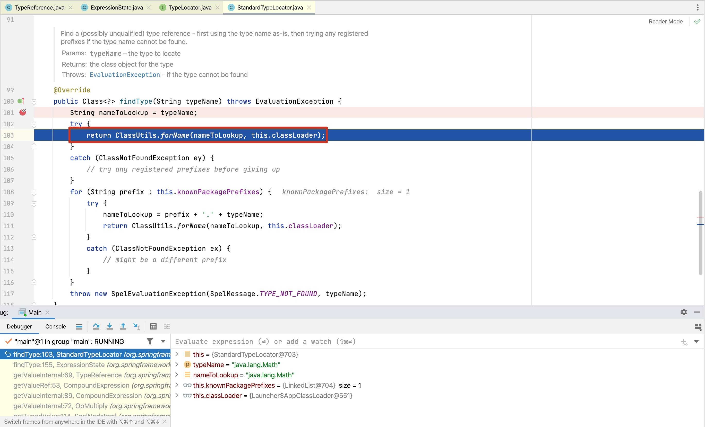


第二部分是一个MethodReference节点，其计算过程如下：
> 图10-14 MethodReference类型值的计算

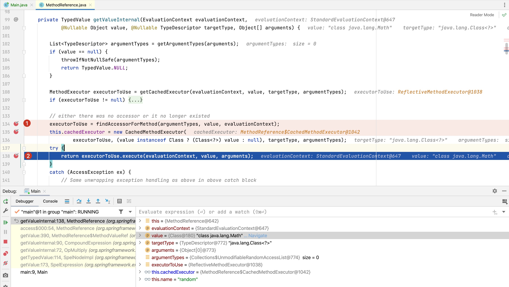

根据java.lang.Class对象、方法名称、参数列表查找需要调用的方法，找到方法后更新方法的缓存cachedExecutor，
然后反射调用该方法并返回调用的值。

其中ReflectiveMethodExecutor类的execute方法完成反射调用，代码如下：
> 图10-15 ReflectiveMethodExecutor类的execute方法完成反射调用

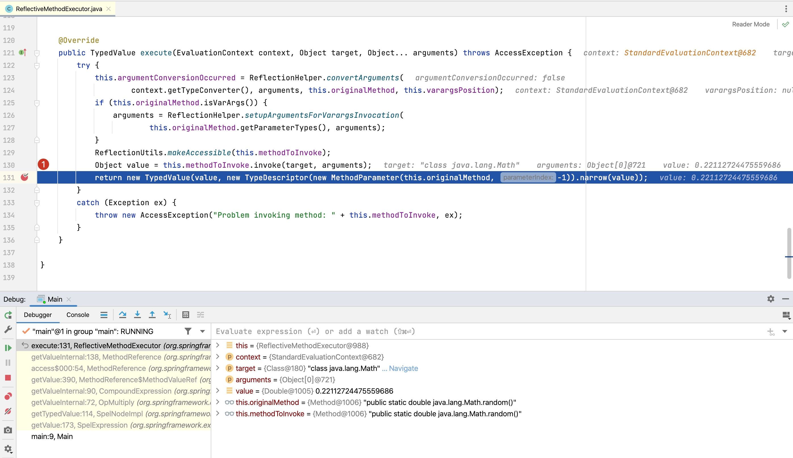

至此，表达式求值过程完成。


