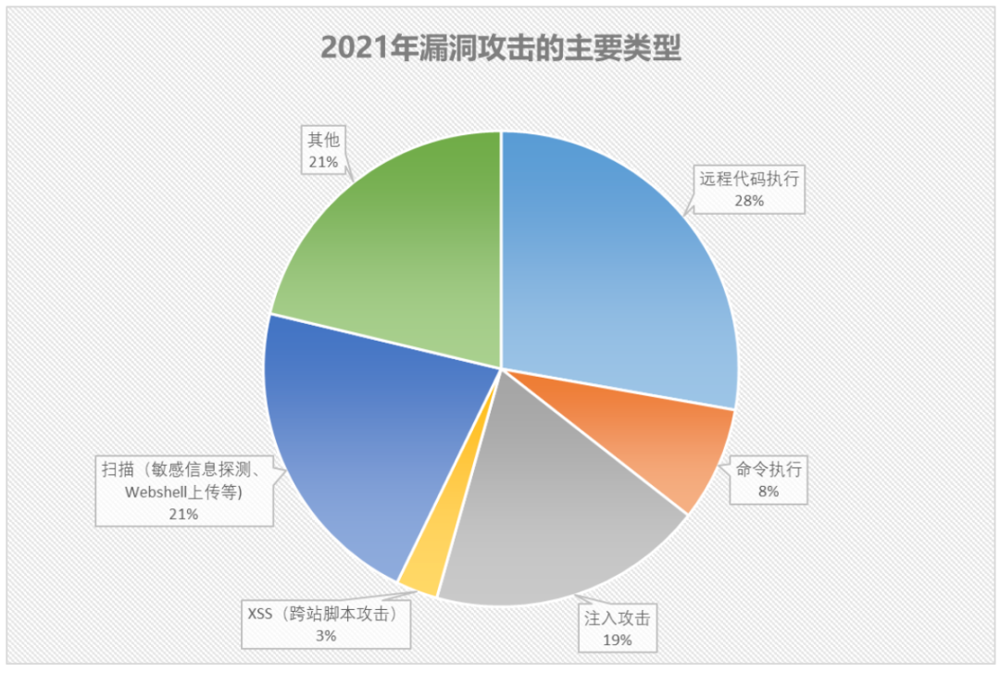
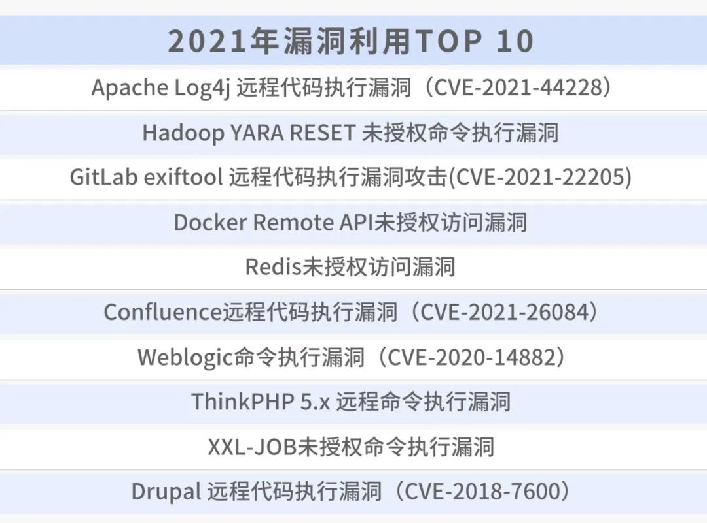

## 1.1 应用安全现状

传统的应用安全防护（WAF）部署在Web应用前线，通过分析流量中来拦截携带有攻击特征的请求。
Web应用程序防火墙在HTTP流量到达应用服务器之前对其进行分析，但是基于流量的检测分析手段容易被绕过。
仅仅通过查看HTTP请求来判断攻击属性是片面的，很容易造成漏洞的错误甄别从而对程序带来毁灭性的影响。
大量Web应用程序攻击绕过了WAF，并且难以对其进行优化。
WAF保护机制仍然需要进一步发展，并且不能成为应用安全计划的唯一支柱。

2021年度公有云安全报告指出，黑客最常利用的漏洞武器为各种远程代码执行（RCE），
其次是扫描探测（指敏感信息探测、WebShell上传探测等），各类命令注入攻击则位居第三，
主要漏洞攻击的数量占比如下图1-1所示。

> 图1-1 主要漏洞攻击的数量占比

漏洞利用是黑客云主机攻击的主要通道之一，公有云安全根据最活跃恶意软件家族使用的漏洞武器，整理出了2021年度黑客最爱的漏洞武器TOP10，如下图1-2所示。

> 图1-2 2021年漏洞漏洞利用TOP10

排名第一的是Apache Log4j2远程代码执行漏洞，这是近十年来最严重的漏洞，由于使用广泛和漏洞利用简单，影响巨大。

