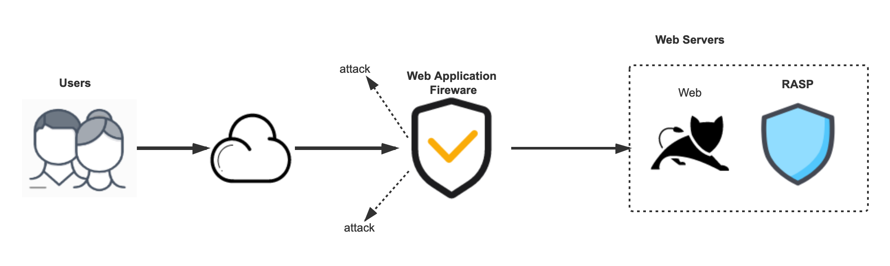

## 1.4 RASP VS WAF

传统的WAF主要通过分析流量中的特征来过滤攻击请求，并拦截携带有攻击特征的请求。
WAF虽然可以有效个过滤出绝大多数恶意请求，但是不知道应用运行时的上下文，
必然会造成一定程度的误报。并且WAF严重依赖于特征库，
各种花式绕过，导致特征编写很难以不变应万变。
RASP相对于WAF的主要优势有：

+ RASP的不同就在于运行在应用之中，与应用融为一体，可以获取到应用运行时的上下文，
根据运行时上下文或者敏感操作，对攻击进行精准的识别或拦截。与此同时，由于RASP运行在应用之中，只要检测点选取合理，获取到的payload已经是解码过的真实payload，可以减少由于WAF规则的不完善导致的漏报。

+ 兼顾东西向流量安全，RASP工作在应用程序内部，不仅可以分析南北向流量的风险，也可以分析企业内部，

应用之间东西向流量的风险。RASP通过Hook应用各个访问入口出口(HTTP、RPC、MQ、DB、Socket...), 追踪事件轨迹。当攻击事件被捕获时, 事件内容将自动填充关联的入口Http、RPC报文、执行攻击时的payload、堆栈等上下文信息, 联动其他安全技术产品, 提供到安全专家应用内、应用间全链路的攻击可视化能力，为溯源提供有力支持。
RASP拥有WAF所不具有的一些优势，越来越成为安全防御体系的标配。
而WAF是成熟、快速、可以大规模部署的安全产品。RASP和WAF是互补的，这是两个纬度的东西。两者的核心区别还是RASP可以更准确的拦截漏洞，甚至能拦0day，而WAF机制基于流量决定了它并不能完整的了解业务内部运转逻辑，且容易被绕过。RASP的解决问题场景，还没有那么直接，更像疫苗，构建的是基于体内信号的免疫力；WAF更像是口罩防护服，很多场景立竿见影，在应用外面包一层盔甲来防御。WAF和RASP两者相互补充，将WAF作为应用外围的防线，RASP作为应用自身的安全防护，确保对攻击的有效拦截。

RASP与WAF并不是相互取代的关系，二者在不同业务和安全防护场景下各有所长。
对于应用防护来说，协同构建边界与应用内生双重防护能力，最大程度降低应用被入侵、数据泄露、服务不可用等风险。

图1-6说明了WAF、HIDS、RASP三类网络安全产品与应用服务的关系。

> 图1-6 WAF、HIDS、RASP三类网络安全产品相当于应用服务的关系

## 1.5 RASP存在的问题

虽然RASP有很多优势，但是由于其本身的实现也导致了很多问题使其难以推广。
+ 侵入性过大

与比较成熟的网络安全产品WAF和HIDS相比，从隔离级别来看，RASP 运行在宿主Java进程之中，隔离级别最低，
与业务仅类加载器隔离，如图1-7所示。如果RASP自身出现问题如死锁、空指针和内存泄漏等，将会直接对业务造成影响。

> 图1-7 WAF、HIDS、RASP三类网络安全产品相当于应用服务的隔离级别

+ 效率问题

由于需要将检测流程插入到字节码文件中，这样会在运行时产生大量不属于业务流程本身的逻辑，
这样会增加业务执行的流程，增加业务请求响应时间。

+ 开发问题

针对不同的语言，RASP底层的实现是不一样的，都需要重新基于语言特性进行专门的开发，
不同语言的RASP实现差异非常大。

+ 部署问题

以Java RASP来举例子，Java RASP有两种部署方式，一种需要在启动前指定Agent的位置，
另一种可以在运行时用attach的方式进行部署，但是他们都存在不同的问题。
在启动前指定agent的位置就以为着在进行部署时需要重启服务，会影响到正常的业务。
在运行时进行attach部署时，由于Java进程已经运行了一方面，RASP初始化时尤其是修改字节码对业务影响很大；
另一方面，Agent加载完成之后，无法卸载，功能更新依然需要依赖业务进程重启。

