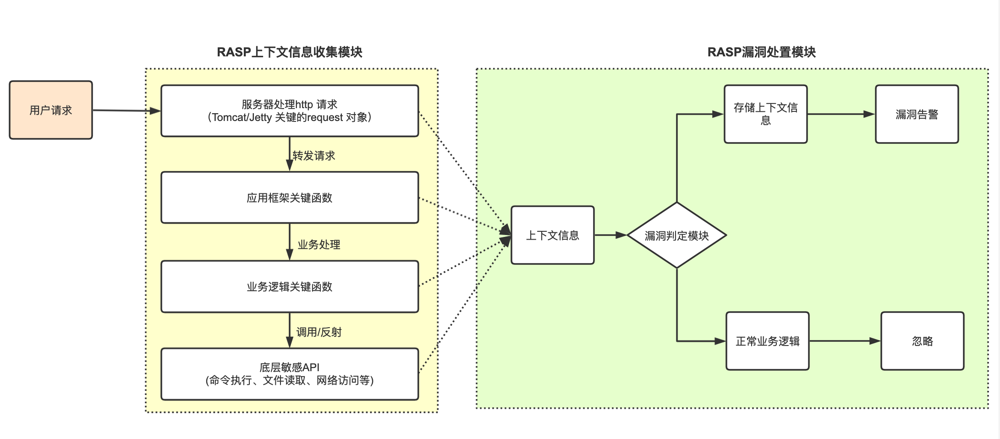

## 1.5 RASP漏洞检测的基本原理
目前RASP的主方向还是Java RASP，它的实现方式是编写一个Java Agent，在Java Agent中调用Instrumentation API将安全检测代码插入到应用的关键函数之中。如图1-8所示，RASP在请求调用链路上中增加多个监控方法，并将参数保存到请求的上下文环境中，当执行到敏感操作时，通过上下文环境、调用堆栈和敏感操作参数来综合判断是否是漏洞攻击。

图1-8 RASP上下文关联与漏洞检测

