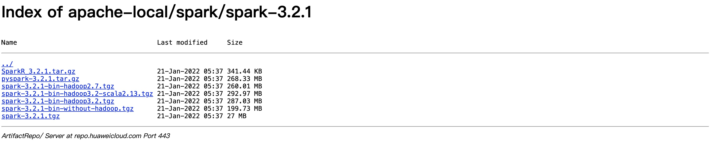
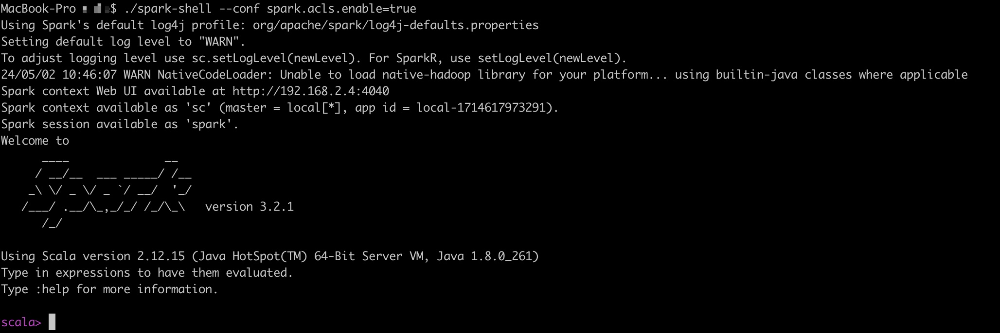
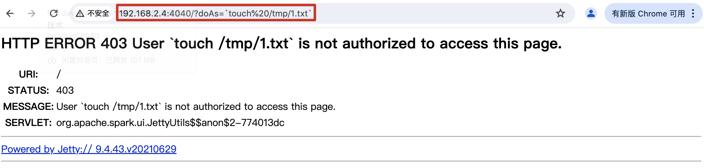
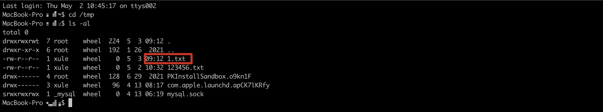
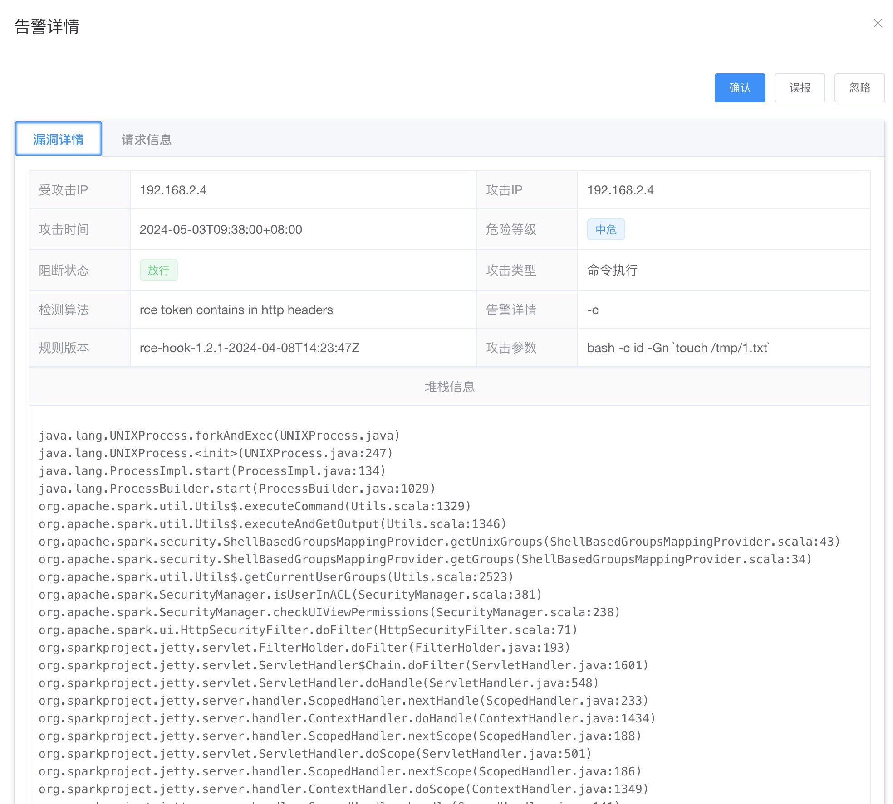
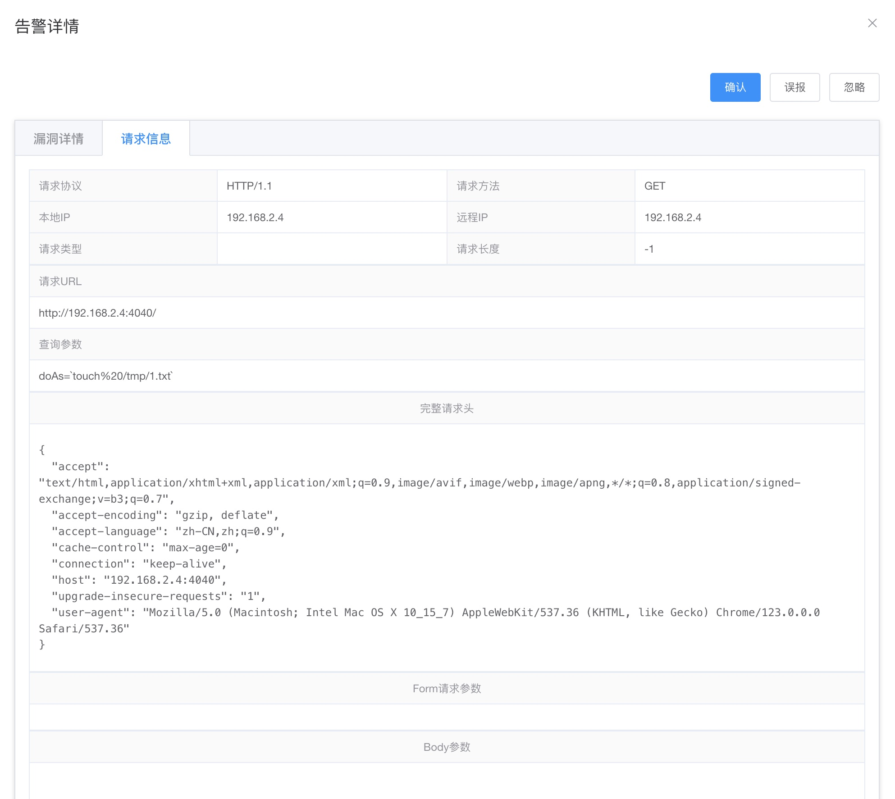

## 9.3 Apache Spark命令注入漏洞

+ 漏洞简介

Apache发布安全公告，修复了一个Apache Spark中存在的命令注入漏洞。 漏洞编号：CVE-2022-33891，漏洞威胁等级：高危。Apache Spark UI提供了通过配置选项Spark.acl.enable启用acl的可能性。 使用身份验证过滤器，这将检查用户是否具有查看或修改应用程序的访问权限。 如果启用了acl，HttpSecurityFilter中的代码路径可以允许某人通过提供任意用户名来执行模拟。 恶意用户可能能够访问权限检查功能，该功能最终将根据他们的输入构建一个 Unix shell 命令并执行它。 这将导致任意 shell 命令执行。

+ 影响版本

Apache Spark <= v3.0.3

3.1.1 <= Apache Spark <= 3.1.2

3.2.0<= Apache Spark <= 3.2.1

+ 环境搭建

下载spark-3.2.1-bin-hadoop2.7.tgz（https://repo.huaweicloud.com/apache/spark/spark-3.2.1/spark-3.2.1-bin-hadoop2.7.tgz）

> 图9-4 spark-3.2.1-bin-hadoop2.7.tgz下载地址



漏洞触发的关键在于是否启用ACL，使用身份验证过滤器。 启动spark脚本如下：
```java
./spark-shell --conf spark.acls.enable=true
```


从启动的日志可以看出，spark web服务端访问的地址为：http://192.168.2.4:4040

在启动地址后面拼接?doAs=`command`即可，这里执行`touch%20/tmp/1.txt`，即在/tmp目录下创建文件1.txt文件。

+ 攻击请求






RASP拦截到的攻击日志如下：


http请求日志


