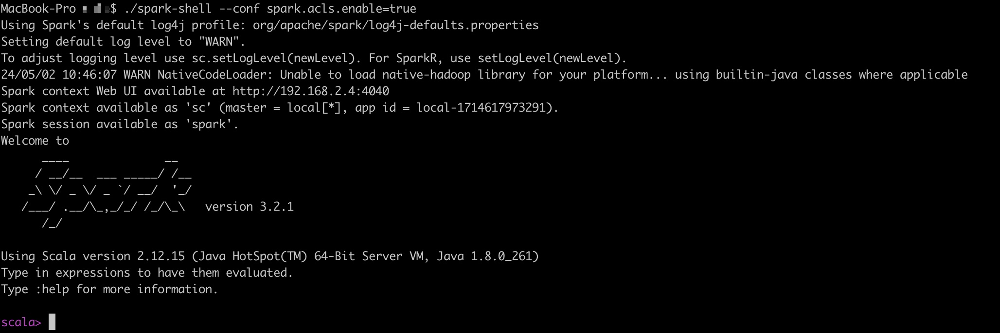
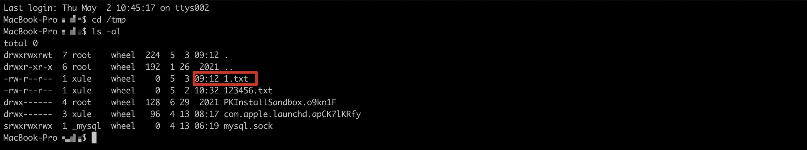
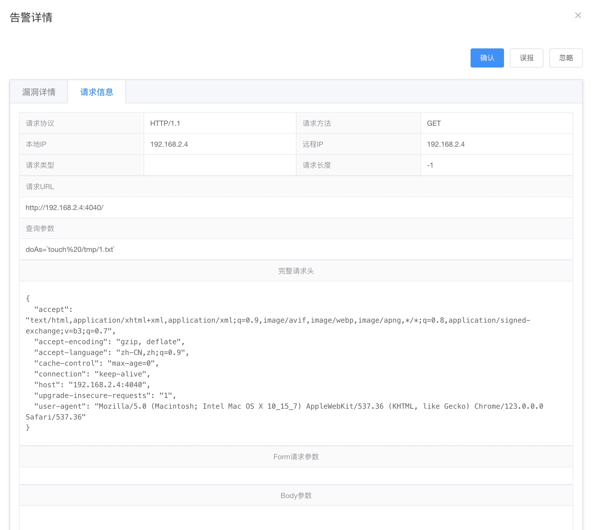

# 9.0 本章简介

Java命令执行漏洞在已经披露的漏洞中占比较大，本章将分析命令执行的一般性原理、
Hook点的选择、漏洞案例和检测算法。

## 9.1 命令执行原理

### 9.1.1 命令执行API

java命令执行方式如下：

+ java.lang.Runtime.exec()
+ java.lang.ProcessBuilder.start()
+ java.lang.ProcessImpl.start()
+ JNI的方式调用动态链接库（该方式属于JNI注入，这里暂不做分析）

在Java中执行命令使用最多的API是`Runtime.getRuntime().exec()`，其用法如下：
```java
Runtime.getRuntime().exec("touch /tmp/1.txt");
```

实际上Runtime类的exec的重载方法有6个，如下所示：
```java
public Process exec(String command)
public Process exec(String command, String[] envp)
public Process exec(String command, String[] envp, File dir)
public Process exec(String cmdarray[])
public Process exec(String[] cmdarray, String[] envp)
public Process exec(String[] cmdarray, String[] envp, File dir)
```
前面5个方法最终都会调用最后一个方法，因此这里仅介绍其中的两个方法。
```java
public Process exec(String command, String[] envp, File dir)
    throws IOException {
    if (command.length() == 0)
    throw new IllegalArgumentException("Empty command");
    // 将字符串解析为token流
    StringTokenizer st = new StringTokenizer(command);
    String[] cmdarray = new String[st.countTokens()];
    for (int i = 0; st.hasMoreTokens(); i++)
    cmdarray[i] = st.nextToken();
    // 调用exec重载方法
    return exec(cmdarray, envp, dir);
}
```

+ command： 需要执行的命令的字符串，会解析为token流；

+ envp： 子进程的环境变量，是一个字符串数组，其中每个元素的环境变量设置格式为name=value，
  如果子进程的环境变量与当前进程一致，则为null；

+ dir：子进程的工作目录，如果子进程的工作目录与当前进程一致，则该参数为null；

exec所有的方法都会调用下面的重载方法。
```java
public Process exec(String[] cmdarray, String[] envp, File dir)
    throws IOException {
    return new ProcessBuilder(cmdarray)
        .environment(envp)
        .directory(dir)
        .start();
}
```
exec方法执行命令实际通过创建ProcessBuilder对象，然后执行start方法。

### 9.1.2 底层调用链路

常用的命令执行API是java.lang.Runtime.exec()和java.lang.ProcessBuilder.start()，
除此之外，还有能力更为底层方法如java.lang.ProcessImpl.start()等。下面是Java命令执行的常用方式。
```java
import java.lang.reflect.Method;
import java.util.Map;

public class Main {
    public static void main(String[] args) throws Exception {

        // 定义命令方式
        String command = "touch /tmp/1.txt /tmp/2.txt /tmp/3.txt";
        String[] commandarray = {"touch", "/tmp/1.txt", "/tmp/2.txt", "/tmp/3.txt"};

        // 命令执行方式1
        Runtime.getRuntime().exec(command);

        // 命令执行方式2
        new ProcessBuilder(commandarray).start();

        // 命令执行方式3
        Class clazz = Class.forName("java.lang.ProcessImpl");
        Method method = clazz.getDeclaredMethod("start", new String[]{}.getClass(), Map.class, String.class, ProcessBuilder.Redirect[].class, boolean.class);
        method.setAccessible(true);
        method.invoke(null, commandarray, null, ".", null, true);
    }
}
```
追踪源码可以发现，所有的命令执行最终执行的方法是`java.lang.UNIXProcess.forkAndExec`，来看下它的代码：
>代码位置： jdk11/src/java.base/unix/classes/java/lang/ProcessImpl.java
```java
private native int forkAndExec(int mode, byte[] helperpath,
                               byte[] prog,
                               byte[] argBlock, int argc,
                               byte[] envBlock, int envc,
                               byte[] dir,
                               int[] fds,
                               boolean redirectErrorStream)
    throws IOException;
```
这是一个native方法，在IDEA中debug上面的命令执行代码并在forkAndExec方法里面抛出异常，操作如下图 9-1 所示。

> 图9-1 debug的命令执行代码


抛出异常的调用栈如下所示：
```java
Exception in thread "main" java.lang.SecurityException: rce block by rasp!
	at java.lang.UNIXProcess.forkAndExec(Native Method)
	at java.lang.UNIXProcess.<init>(UNIXProcess.java:247)
	at java.lang.ProcessImpl.start(ProcessImpl.java:134)
	at java.lang.ProcessBuilder.start(ProcessBuilder.java:1029)
	at java.lang.Runtime.exec(Runtime.java:621)
	at java.lang.Runtime.exec(Runtime.java:451)
	at java.lang.Runtime.exec(Runtime.java:348)
	at Main.main(Main.java:12)
```

上面的测试代码运行在Unix系统，命令执行的最终类为java.lang.UNIXProcess，如果在Windows系统上执行命令，调用栈稍有不同。
下图总结了不同操作系统的命令执行调用过程，如图9-2所示。

> 图9-2 Windows和Linux操作系统的命令执行方法调用过程


### 9.1.3 Hook点的选择

传统RASP一般会选择上图中第1个层次的类，即java.lang.ProcessImpl(JDK9以上)和java.lang.UNIXProcess(JDK8及以下)的`<init>`、`start`方法，
因为这些方法都是Java层面的，可以直接修改方法的字节码来增加检测逻辑。

而命令执行的最终方法是`forkAndExec`，因此仅Hook了start等方法是存在绕过的可能（可以了解命令执行相关的绕过case，这里不展开）。
因此在命令执行的Hook点选择上，在不考虑性能的情况下，理论上是越底层越好，而第三层次的方法是c/c++构建，在JavaAgent上无法实现Hook。只能退而求其次，选择第二层次的方法作为Hook点。

因此，RASP的命令执行的Hook点应该至少包含如下几个：
+ 在JDK的Unix版本上，如果JDK的版本在8及以下，Hook点是`java.lang.UNIXProcess.forkAndExec`;
  JDK版本高于8，Hook点是`java.lang.ProcessImpl.forkAndExec`；
+ 在JDK的Windows版本，Hook点是`java.lang.ProcessImpl.create`， windows系统上Hook点没有JDK差异；

## 9.2 Java Native命令执行

在前面的章节中，读者了解到RASP实现的基本原理是修改目标方法的字节码，将检测逻辑插入到目标方法进入、返回和抛出异常等处。
而在Java方法中有一类比较特殊，它们`没有方法体`，如接口中的方法、抽象方法和native方法等，
其中native方法就是Java调用非Java代码的接口，一般为JVM核心关键的方法，如在上一节介绍的命令执行的native方法。
本节将介绍RASP修改native方法原理，并给出一个Demo。

### 9.2.1 基本原理

+ native方法与c++实现的解析规则

这里以命令执行的方法来说明，先来看下命令执行的native方法和它的本地实现。
> 源码位置：jdk11/src/java.base/unix/classes/java/lang/ProcessImpl.java
```java
private native int forkAndExec(int mode, byte[] helperpath,
                                   byte[] prog,
                                   byte[] argBlock, int argc,
                                   byte[] envBlock, int envc,
                                   byte[] dir,
                                   int[] fds,
                                   boolean redirectErrorStream)
        throws IOException;
```
对应的native方法实现(hotspot)如下：

> 源码位置：jdk11/src/java.base/unix/native/libjava/ProcessImpl_md.c
```c++
JNIEXPORT jint JNICALL
        Java_java_lang_ProcessImpl_forkAndExec(JNIEnv *env,
        jobject process,
        jint mode,
        jbyteArray helperpath,
        jbyteArray prog,
        jbyteArray argBlock, jint argc,
        jbyteArray envBlock, jint envc,
        jbyteArray dir,
        jintArray std_fds,
        jboolean redirectErrorStream){
    // 不是本文重点，代码省略...
}
```
可以看出，native方法的实现名称是由Java类的`包名称`和`方法名称`组成。这个规则这称之为`standard resolution`（标准解析）。

+ 设置native方法解析的Prefix

修改字节码主要依赖`java.lang.instrument.Instrumentation`API接口中的addTransformer和retransformClasses等方法，
如果深入Instrumentation API，我们还注意到存在如下方法：

> 源码位置：jdk11/src/java.instrument/share/classes/java/lang/instrument/Instrumentation.java

```java
void setNativeMethodPrefix(ClassFileTransformer transformer, String prefix);
```
从该方法的注释可以看出，当标准解析失败后，可以通过在Java名称增加前缀来重新查找对应的native方法实现。
该功能默认是关闭的，需要在JavaAgent包中的`MANIFEST.MF`配置文件中设置，即：
`Can-Set-Native-Method-Prefix: true`。 MANIFEST.MF的示例如下：
```java
Manifest-Version: 1.0
Premain-Class: com.jrasp.example.agent.Agent
Agent-Class: com.jrasp.example.agent.Agent
Can-Redefine-Classes: true
Can-Retransform-Classes: true 
Can-Set-Native-Method-Prefix: true

```
上面的MANIFEST.MF文件不仅配置了JavaAgent入口类，并且开启了`Can-Redefine-Classes`、`Can-Retransform-Classes`和`Set-Native-Method-Prefix`等三个开关。
可以使用Instrumentation API中的方法`isNativeMethodPrefixSupported`来检测JavaAgent是否开启了该功能。

+ native方法解析举例说明

假设我们有这样一个native方法，标准解析下对应的native方法实现。
```java
native boolean foo(int x);  ====> Java_somePackage_someClass_foo(JNIEnv* env, jint x);
```
给JVM增加一个ClassTransformer并设置setNativeMethodPrefix的值为`wrapped_`，当标准解析失败后，方法的解析规则如下：
```java
native boolean wrapped_foo(int x);  ====> Java_somePackage_someClass_foo(JNIEnv* env, jint x);
```

> 图9-3 native方法的解析规则


方法链接有两种方式发生，使用JNI函数RegisterNatives进行显式解析和正常的自动解析。
对于RegisterNatives，JVM将尝试这种关联：
```java
method(foo) -> nativeImplementation(foo)
```
当这失败时，将使用指定的前缀将方法名前置，从而得到正确的解析：
```java
method(wrapped_foo) -> nativeImplementation(foo)
```

对于自动解析，JVM将尝试：
```java
method(wrapped_foo) -> nativeImplementation(wrapped_foo)
```
失败时，将从实现名称中删除指定的前缀并重试解析，从而得到正确的解析：
```java
method(wrapped_foo) -> nativeImplementation(foo)
```
如果找到上面的其中一个对应关系，则执行。否则，因为没有任何一个合适的解析方式，于是宣告这个过程失败。


+ 多个transformer场景

虚拟机是按transformer被加入到的JVM顺序去解析的（即addTransformer）。 假设有三个transformer要被加入进来，他们的次序和相对应的prefix分别为：transformer1和"prefix1_"，transformer2 和"prefix2_"，transformer3和"prefix3_"。
虚拟机做的解析规则为
```java
native boolean prefix3_prefix2_prefix1_foo(int x);  ====> Java_somePackage_someClass_foo(JNIEnv* env, jint x);
```

###  9.2.2 使用ASM修改Native方法

由于native不能被直接插入指令（它们没有字节码），必须使用可以插入指令的非native进行包装。
例如，我们有下面的一个 native 方法:
```java
native boolean foo(int x);
```
我们能将字节码文件转换为下面的形式：
```java
boolean foo(int x) {
   //... record entry to foo ...
   return wrapped_foo(x);
}

native boolean wrapped_foo(int x);
```
并且native方法的解析规则设置为：
```java
method(wrapped_foo) -> nativeImplementation(foo)
```
因此，native方法Hook策略可以细分为如下三步：

+ 原始的native变为非native方法，并增加方法体；
+ 在方法体中调用wrapper后的native方法；
+ 增加wrapper的native方法；

下面的代码使用ASM修改命令执行方法的Demo，关键代码如下：

Agent启动类代码如下所示：
```java
public class Agent {

    public static void premain(String args, Instrumentation inst) {
        main(args, inst);
    }

    public static void agentmain(String args, Instrumentation inst) {
        main(args, inst);
    }

    public static void main(String args, Instrumentation inst) {
        System.out.println(String.format("%s  INFO [rasp] %s ",
                new SimpleDateFormat("yyyy-MM-dd HH:mm:ss.sss").format(new Date()), "enter agent"));
        // 注册ClassFileTransformer对象
        RaspClassFileTransformer raspClassFileTransformer = new RaspClassFileTransformer(inst);
        inst.addTransformer(raspClassFileTransformer);
    }
}
```
加载Agent之后，向JVM的Instrumentation注册一个类转换ClassFileTransformer对象。

来看下实现的ClassFileTransformer代码，如下所示：
```java
public class RaspClassFileTransformer implements ClassFileTransformer {

    private final Instrumentation inst;

    public RaspClassFileTransformer(Instrumentation inst) {
        this.inst = inst;
    }

    @Override
    public byte[] transform(ClassLoader loader, String className,
                            Class<?> classBeingRedefined,
                            ProtectionDomain protectionDomain,
                            byte[] classfileBuffer) throws IllegalClassFormatException {
        // 匹配指定的类
        if ("java/lang/UNIXProcess".equals(className) || "java/lang/ProcessImpl".equals(className)) {
            final ClassReader cr = new ClassReader(classfileBuffer);
            final ClassWriter cw = new ClassWriter(cr, COMPUTE_FRAMES | COMPUTE_MAXS);
            cr.accept(new RaspClassVisitor(ASM9, cw, cr.getClassName(), inst, this), EXPAND_FRAMES);
            return dumpClassIfNecessary(cr.getClassName(), cw.toByteArray());
        }

        return null;
    }

    // dump修改后的字节码到文件中
    private static byte[] dumpClassIfNecessary(String className, byte[] data) {
        final File dumpClassFile = new File("./rasp-class-dump/" + className + ".class");
        final File classPath = new File(dumpClassFile.getParent());
        if (!classPath.mkdirs() && !classPath.exists()) {
            return data;
        }
        try {
            FileUtils.writeByteArrayToFile(dumpClassFile, data);
        } catch (IOException e) {
            e.printStackTrace();
        }
        return data;
    }

}
```
在transform方法中如果匹配到命令执行的相关类，进入到方法的修改流程中，修改目标方法字节码的代码在RaspClassVisitor中，来看下它的实现。
```java
public class RaspClassVisitor extends ClassVisitor {
    private RaspMethod method = null;
    private final String targetClassInternalName;
    private final Instrumentation inst;
    private RaspClassFileTransformer raspClassFileTransformer;
    private final static String NATIVE_PREFIX = "$$JRASP$$_"; // native方法前缀

    public RaspClassVisitor(final int api, final ClassVisitor cv, String targetClassInternalName, Instrumentation inst,
                            RaspClassFileTransformer raspClassFileTransformer) {
        super(api, cv);
        this.targetClassInternalName = targetClassInternalName;
        this.inst = inst;
        this.raspClassFileTransformer = raspClassFileTransformer;
    }

    @Override
    public MethodVisitor visitMethod(final int access, final String name, final String desc, final String signature, final String[] exceptions) {
        if ("forkAndExec".equals(name)) { // 匹配指定方法
            // 设置native方法解析前缀
            if (inst.isNativeMethodPrefixSupported()) {
                inst.setNativeMethodPrefix(raspClassFileTransformer, NATIVE_PREFIX);
            } else {
                throw new UnsupportedOperationException("Native Method Prefix Unspported");
            }
            // 修改方法访问修饰符
            // 即 private native int forkAndExec 变成 private int forkAndExec
            int newAccess = access & ~Opcodes.ACC_NATIVE;
            method = new RaspMethod(access, NATIVE_PREFIX + name, desc);
            final MethodVisitor mv = super.visitMethod(newAccess, name, desc, signature, exceptions);
            return new AdviceAdapter(api, new JSRInlinerAdapter(mv, newAccess, name, desc, signature, exceptions), newAccess, name, desc) {
                @Override
                public void visitEnd() {
                    // 在的forkAndExec方法中调用native方法$$JRASP$$_forkAndExec
                    loadThis();
                    loadArgs();
                    mv.visitMethodInsn(Opcodes.INVOKESPECIAL, targetClassInternalName, method.getName(), method.getDescriptor(), false);
                    returnValue();
                    super.visitEnd();
                }
            };
        }
        return super.visitMethod(access, name, desc, signature, exceptions);
    }

    @Override
    public void visitEnd() {
        if (method != null) {
            // 新增一个包含前缀的native方法，即$$JRASP$$_forkAndExec
            int newAccess = (Opcodes.ACC_PRIVATE | Opcodes.ACC_NATIVE | Opcodes.ACC_FINAL);
            MethodVisitor mv = cv.visitMethod(newAccess, method.getName(), method.getDescriptor(), null, null);
            mv.visitEnd();
        }
        super.visitEnd();
    }
}
```

在visitMethod方法中，如果匹配到目标方法，首先设置native方法解析的前缀，然后修改方法的访问修饰符，
即将native方法的native关键子去掉，并在方法中调用增加了前缀的native方法。
在visitEnd方法中，新增了一个包含前缀的native方法。


再来看下agent工程的pom.xml的配置，与agent有关的关键配置如下：
```xml
<plugin>
    <groupId>org.apache.maven.plugins</groupId>
    <artifactId>maven-jar-plugin</artifactId>
    <version>3.2.2</version>
    <configuration>
        <archive>
            <manifest>
                <addClasspath>true</addClasspath>
            </manifest>
            <manifestEntries>
                <Premain-Class>com.jrasp.example.agent.Agent</Premain-Class>
                <Agent-Class>com.jrasp.example.agent.Agent</Agent-Class>
                <Can-Redefine-Classes>true</Can-Redefine-Classes>
                <Can-Retransform-Classes>true</Can-Retransform-Classes>
                <!--允许设置native方法的解析的前缀-->
                <Can-Set-Native-Method-Prefix>true</Can-Set-Native-Method-Prefix>
            </manifestEntries>
        </archive>
    </configuration>
</plugin>                                                                                                                                                      
```

### 9.2.3 修改后的native方法

编译之后以premain方式启动：
```java
java -javaagent:rce-agent-1.0-SNAPSHOT.jar -jar springboot.jar
```
因为命令执行的类在应用启动之后不会主动加载，因此需要触发命令执行类的加载，就可以将命令执行类的字节码修改。
rce-agent在修改字节码后会将字节码文件dump在应用目录下的rasp-class-dump文件中。
来看下`java.lang.UNIXProcess`的 `forkAndExec`修改前后的字节码。
原始字节码：
```java
private final native int forkAndExec(int var1, byte[] var2, byte[] var3, byte[] var4, int var5, byte[] var6, int var7, byte[] var8, int[] var9, boolean var10);
```

修改后的字节码：
```java
// 修改方法访问符，并在方法中调用native方法
private int forkAndExec(int var1, byte[] var2, byte[] var3, byte[] var4, int var5, byte[] var6, int var7, byte[] var8, int[] var9, boolean var10) throws IOException {
    // 一般在这里增加检测逻辑
    return this.$$JRASP$$_forkAndExec(var1, var2, var3, var4, var5, var6, var7, var8, var9, var10);
}

// 新增包含前缀的native方法
private final native int $$JRASP$$_forkAndExec(int var1, byte[] var2, byte[] var3, byte[] var4, int var5, byte[] var6, int var7, byte[] var8, int[] var9, boolean var10);
```
修改后的`forkAndExec`有方法体了，就可以在执行该方法时增加RASP检测逻辑了。


## 9.3 Apache Spark命令注入漏洞

+ 漏洞简介

Apache发布安全公告，修复了一个Apache Spark中存在的命令注入漏洞。 漏洞编号：CVE-2022-33891，漏洞威胁等级：高危。Apache Spark UI提供了通过配置选项Spark.acl.enable启用acl的可能性。 使用身份验证过滤器，这将检查用户是否具有查看或修改应用程序的访问权限。 如果启用了acl，HttpSecurityFilter中的代码路径可以允许某人通过提供任意用户名来执行模拟。 恶意用户可能能够访问权限检查功能，该功能最终将根据他们的输入构建一个 Unix shell 命令并执行它。 这将导致任意 shell 命令执行。

+ 影响版本

Apache Spark <= v3.0.3

3.1.1 <= Apache Spark <= 3.1.2

3.2.0<= Apache Spark <= 3.2.1

+ 环境搭建

下载spark-3.2.1-bin-hadoop2.7.tgz（https://repo.huaweicloud.com/apache/spark/spark-3.2.1/spark-3.2.1-bin-hadoop2.7.tgz）

> 图9-4 spark-3.2.1-bin-hadoop2.7.tgz下载地址


漏洞触发的关键在于是否启用ACL，使用身份验证过滤器。 启动spark脚本如下：
```java
./spark-shell --conf spark.acls.enable=true
```


从启动的日志可以看出，spark web服务端访问的地址为：http://192.168.2.4:4040

在启动地址后面拼接?doAs=`command`即可，这里执行`touch%20/tmp/1.txt`，即在/tmp目录下创建文件1.txt文件。

+ 攻击请求




RASP拦截到的攻击日志如下：


http请求日志


## 9.4 命令执行检测算法

### 9.4.1 堆栈检测算法
不管是在离线分析还是在实时检测中，本算法都是RASP中使用最为广泛的算法之一。
算法的检测原理也比较简单，当执行到命令执行时，获取当前线程的调用栈，如果调用栈中存在非法栈，即可判定为攻击。
常用的非法攻击栈如下：
```java
// 栈特征来源于OpenRasp
com.thoughtworks.xstream.XStream.unmarshal
java.beans.XMLDecoder.readObject
java.io.ObjectInputStream.readObject
org.apache.dubbo.common.serialize.hessian2.Hessian2ObjectInput.readObject
com.alibaba.fastjson.JSON.parse
com.fasterxml.jackson.databind.ObjectMapper.readValue
payload.execCommand
net.rebeyond.behinder
org.springframework.expression.spel.support.ReflectiveMethodExecutor.execute
freemarker.template.utility.Execute.exec
freemarker.core.Expression.eval
bsh.Reflect.invokeMethod
org.jboss.el.util.ReflectionUtil.invokeMethod
org.codehaus.groovy.runtime.ProcessGroovyMethods.execute
org.codehaus.groovy.runtime.callsite.AbstractCallSite.call
ScriptFunction.invoke
com.caucho.hessian.io.HessianInput.readObject
org.apache.velocity.runtime.parser.node.ASTMethod.execute
org.apache.commons.jexl3.internal.Interpreter.call
javax.script.AbstractScriptEngine.eval
javax.el.ELProcessor.getValue
ognl.OgnlRuntime.invokeMethod
javax.naming.InitialContext.lookup
org.mvel2.MVEL.executeExpression
org.mvel.MVEL.executeExpression
ysoserial.Pwner
org.yaml.snakeyaml.Yaml.load
org.mozilla.javascript.Context.evaluateString
command.Exec.equals
java.lang.ref.Finalizer.runFinalizer
java.sql.DriverManager.getConnection
```
一般的，可以使用RASP提取已经漏洞的调用栈，选取具有较高执行权限的类和方法。
因为栈特征是从已知漏洞或者漏洞利用链上提取出来的特征，因此该算法的缺点是不能很好的解决未知漏洞的威胁。

### 9.4.2 反射执行命令

正常的用户也有命令执行的需求，但是正常用户执行命令时一般会直接调用命令执行API，而不是使用反射的方式调用命令执行API。
因为使用反射来执行命令的代码更加复杂，同时性能也更低。来看如下调用栈，这是一段用户正常的命令执行：
> 场景：直接调用命令执行API
```java
// [1]命令执行API
java.lang.ProcessImpl.start(ProcessImpl.java)      
java.lang.ProcessBuilder.start(ProcessBuilder.java:1029)
java.lang.Runtime.exec(Runtime.java:620)
java.lang.Runtime.exec(Runtime.java:485)
// [2]用户代码
com.alibaba.inf.cto.util.ProcessInfoUtil.getSystemInfoByCommand(ProcessInfoUtil.java:256)  
com.alibaba.inf.cto.util.ProcessInfoUtil.getHostInfoByIp(ProcessInfoUtil.java:242)
com.alibaba.adsc.predict.monitor.ponitor.getHostName(PMonitor.java:105)
com.alibaba.adsc.predict.monitor.ponitor.lambda$makeSureExist$0(PMonitor.java:94)
com.alibaba.adsc.predict.monitor.ponitor$$Lambda$427/2097793174.run(Unknown Source)
java.util.concurrent.Executors$RunnableAdapter.call(Executors.java:511)
java.util.concurrent.FutureTask.run(FutureTask.java:266)
java.util.concurrent.ThreadPoolExecutor.runWorker(ThreadPoolExecutor.java:1142)
java.util.concurrent.ThreadPoolExecutor$Worker.run(ThreadPoolExecutor.java:617)
java.lang.Thread.run(Thread.java:745)
```
从调用栈可以看出，用户在ProcessInfoUtil.getSystemInfoByCommand中直接调用了命令执行的API，中间无反射的操作。
如果用户代码与命令执行代码之间有反射的调用栈，可以判定为攻击。

### 9.4.3 用户输入参数匹配

检测用户命令执行的参数来源于用户的输入参数中，即命令执行的参数包含在http的请求中，用户的输入包括：http参数、cookie和header等。
例如有如下命令执行：
```java
cat /etc/passwd
```
将命令执行的参数转为有效的token流，即`cat`、`etc`、`passwd`等三个字符串，通过与http参数比对即可。
该算法能够很好的识别命令执行的后门，但是对于http请求参数或者命令执行的参数字符串较长时，性能较低。

### 9.4.4 检测常用的渗透命令
常用的渗透命令列举部分如下：
```java
whoami、wget、echo、touch、pwd、ifconfig、net、wget、telnet、ls、ping
// 其他可以参考jrasp命令执行模块的参数
```
除了以上几种检测算法，命令执行的批量不会很高，可以将系统所有的命令执行都记录并上报日志，作为监控日志或者安全基线。