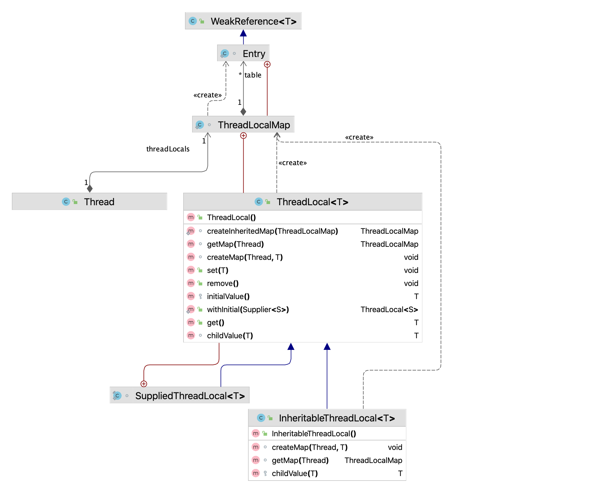

## 5.2 源码解析

### 5.2.1 ThreadLocal源码解析

先来看下ThreadLocal类的继承关系




+ 属性字段
```java
/**
 * 每个ThreadLocal实例都有一个对应的threadLocalHashCode
 * 这个值将会用于在ThreadLocalMap中找到ThreadLocal对应的value值
 */
private final int threadLocalHashCode = nextHashCode();

/**
 * ThreadLocal实例hash值的计算的基础
 */
private static AtomicInteger nextHashCode = new AtomicInteger();

/**
 *T hreadLocal实例hash值的计算的增量
 */
private static final int HASH_INCREMENT = 0x61c88647;
```
每个ThreadLocal实例都有一个threadLocalHashCode值，这个值由nextHashCode和HASH_INCREMENT计算出来。

+ 内部类
```java
static final class SuppliedThreadLocal<T> extends ThreadLocal<T> {

    private final Supplier<? extends T> supplier;

    SuppliedThreadLocal(Supplier<? extends T> supplier) {
        this.supplier = Objects.requireNonNull(supplier);
    }

    @Override
    // 重写了initialValue()来设置初始值
    protected T initialValue() {
        // Supplier不允许为null
        return supplier.get();
    }
}
```
SuppliedThreadLocal是JDK8新增的内部类，只是扩展了ThreadLocal的初始化值的方法而已，
允许使用JDK8新增的Lambda表达式赋值。
需要注意的是，函数式接口Supplier不允许为null，使用方法可参考上面的使用示例  。

+ 构造方法  
```java
public ThreadLocal() {
}
```
可以看到其构造方法没有进行任何操作。

+ nextHashCode)_

创建ThreadLocal实例时生成其对应的hashcode，每次原子增加HASH_INCREMENT的大小。
```java
private static int nextHashCode() {
    return nextHashCode.getAndAdd(HASH_INCREMENT);
}
```

+ initialValue()
```java
protected T initialValue() {
    return null;
}
```

返回当前线程的ThreadLocal初始设置值。这个方法在当前线程第一次调用ThreadLocal.get方法时进行调用，如果之前已经通过set方法设置过值，则不会调用。
这个方法需要我们自行实现，来完成定制操作，
也就是我们希望ThreadLocal在每个线程中初始化值不同时可以进行定制，也就是上面示例中那样的操作。

+ withInitial()

Lambda表达式赋值，可参考上面示例。
```java
public static <S> ThreadLocal<S> withInitial(Supplier<? extends S> supplier) {
    return new SuppliedThreadLocal<>(supplier);
}
```

+ get()

```java
public T get() {
    // 获取当前线程
    Thread t = Thread.currentThread();
    // 获取当前线程持有的的ThreadLocalMap
    ThreadLocalMap map = getMap(t);
    // 非空
    if (map != null) {
        // 获取ThreadLocalMap中对应当前ThreadLocal的Entry
        ThreadLocalMap.Entry e = map.getEntry(this);
        // 非空则获取对应的value
        if (e != null) {
            @SuppressWarnings("unchecked")
            T result = (T)e.value;
            return result;
        }
    }
    // map还未初始化或当前ThreadLocal的Entry为空则调用
    return setInitialValue();
}
```
获取当前线程的ThreadLocalMap中对应当前ThreadLocal的Entry，
如果ThreadLocalMap还未初始化或当前ThreadLocal的Entry为空则调用setInitialValue，
从此也能看出其使用的是懒加载，用到时才进行初始化。

+ setInitialValue()

初始化操作，返回初始化的值
```java
private T setInitialValue() {
    // 调用自定义初始化方法
    T value = initialValue();
    Thread t = Thread.currentThread();
    ThreadLocalMap map = getMap(t);
    if (map != null)
        // 已经初始化，则set操作
        map.set(this, value);
    else
        // 未初始化则初始化并赋值
        createMap(t, value);
    return value;
}
```

+ set(T value)

set操作与setInitialValue类似，只是value是外部传入的。
```java
public void set(T value) {
    Thread t = Thread.currentThread();
    ThreadLocalMap map = getMap(t);
    if (map != null)
        map.set(this, value);
    else
        createMap(t, value);
}
```
+ remove()

移除当前线程ThreadLocalMap对应的ThreadLocal的Entry，如果当前线程调用了remove之后又调用get，
则会重新调用initialValue，可参考上面的get方法。

```java
public void remove() {
    ThreadLocalMap m = getMap(Thread.currentThread());
    if (m != null) {
        // 通过ThreadLocalMap的remove()删除
        m.remove(this);
    }
}                                                      
```

+ getMap()

获取线程的threadLocals
```java
ThreadLocalMap getMap(Thread t) {
    return t.threadLocals;
}
```

+ createMap()

创建（初始化）ThreadLocalMap，并通过firstValue设置初始值
```java
void createMap(Thread t, T firstValue) {
    t.threadLocals = new ThreadLocalMap(this, firstValue);
}
```

### 5.2.2 ThreadLocal在线程的初始化 

ThreadLocal对象保存在Thread对象中，来看下Thread是如何保存变量的。
```java
/* ThreadLocal values pertaining to this thread. This map is maintained
 * by the ThreadLocal class. */
ThreadLocal.ThreadLocalMap threadLocals = null;

/*
 * InheritableThreadLocal values pertaining to this thread. This map is
 * maintained by the InheritableThreadLocal class.
 */
ThreadLocal.ThreadLocalMap inheritableThreadLocals = null;
```

