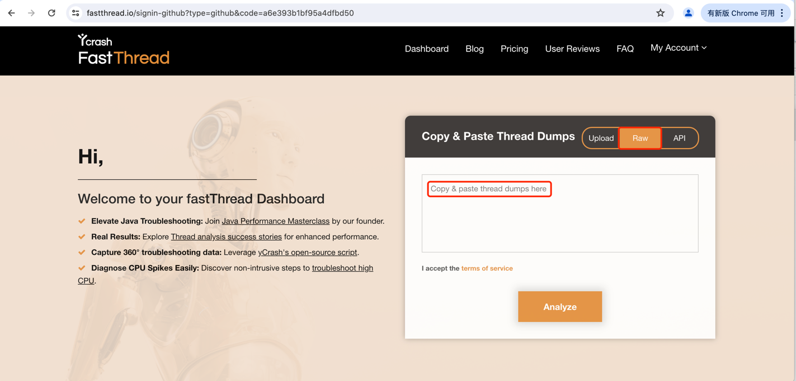
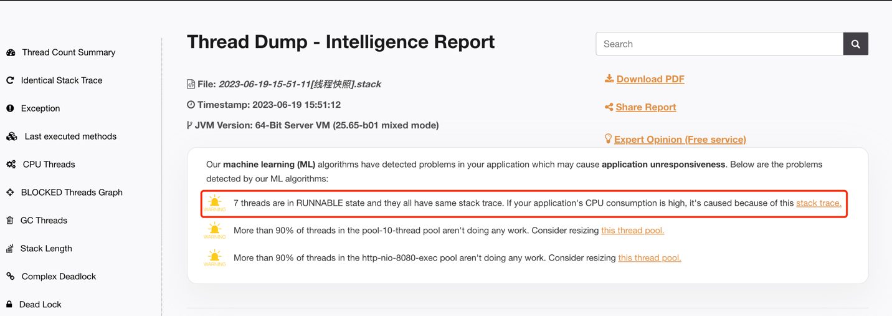

## 7.2 jstack 工具

jstack用于生成Java线程转储快照，以便分析Java应用程序的线程状态和调用栈信息。
它可以帮助开发人员定位死锁、死循环、线程阻塞等问题，
并提供线程运行轨迹，有助于进行线程级别的故障排查。

### 7.2.1 基本使用

其用法可以通过 jstack -help 来查看。
```java
MacBook-Pro root$ jstack -help
Usage:
    jstack [-l] <pid>
        (to connect to running process)
    jstack -F [-m] [-l] <pid>
        (to connect to a hung process)
    jstack [-m] [-l] <executable> <core>
        (to connect to a core file)
    jstack [-m] [-l] [server_id@]<remote server IP or hostname>
        (to connect to a remote debug server)

Options:
    -F  to force a thread dump. Use when jstack <pid> does not respond (process is hung)
    -m  to print both java and native frames (mixed mode)
    -l  long listing. Prints additional information about locks
    -h or -help to print this help message
```

### 7.2.2 源码分析

> 源码位置 src/jdk.jcmd/share/classes/sun/tools/jstack/JStack.java

核心实现如下:
```java
private static void runThreadDump(String pid, String args[]) throws Exception {
    VirtualMachine vm = null;
    try {
        vm = VirtualMachine.attach(pid);
    } catch (Exception x) {
        // 异常处理
    }
    
    InputStream in = ((HotSpotVirtualMachine)vm).remoteDataDump((Object[])args);

    // read to EOF and just print output
    byte b[] = new byte[256];
    int n;
    do {
        n = in.read(b);
        if (n > 0) {
            String s = new String(b, 0, n, "UTF-8");
            System.out.print(s);
        }
    } while (n > 0);
    in.close();
    vm.detach();
}
```
基本原理是基于attach机制，读取目标JVM的信息，来看下HotSpotVirtualMachine的remoteDataDump方法，实现如下：
```java
public InputStream remoteDataDump(Object ... args) throws IOException {
    return executeCommand("threaddump", args);
}
```
可以看出，attach成功后给目标JVM发送`threaddump`命令。

### 7.2.3 CPU性能分析

+ 手动分析jstack输出的栈

服务器的CPU占用高，通过命令`top -H -p pid`查看指定Java进程的内部线程信息

+ 使用fastthread.io分析输出栈

一般的，jstack输出jvm的线程状态，线程数量可能高达数百个， 很难直观的发现潜在性能问题，这时需要借助辅助工具分析。

https://fastthread.io 是一个专业分析线程栈的网站，能够图形化分析热点代码、死锁和导出火焰图。

图7-2 是fastthread.io网站的首页，将jstack的输出复制到分析看窗口即可。



某次CPU升高的栈分析如下：

线程Dump - 智能报告如下图7-3所示。


具有相同堆栈的线程分析如下图7-4所示：


通过上面的分析，比较容易的分析出性能瓶颈，然后针对性的进行代码优化，能够解决cpu升高的问题。

