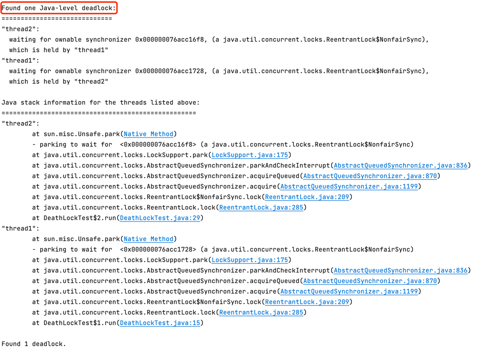
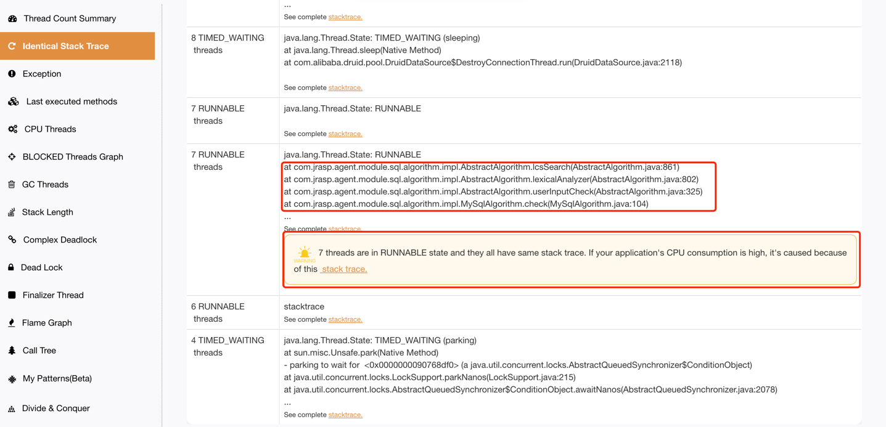

## 7.2 jstack 工具

jstack用于生成Java线程转储快照，以便分析Java应用程序的线程状态和调用栈信息。
它可以帮助研发人员定位死锁、死循环、线程阻塞和分析coredump文件等问题，并提供线程运行轨迹，有助于进行线程级别的故障排查。
总之，jstack非常有用，是Java程序员故障排查必备的工具之一。

### 7.2.1 基本使用

其用法可以通过 jstack -help 来查看。
```java
MacBook-Pro root$ jstack -help
Usage:
    jstack [-l] <pid>
        (to connect to running process)
    jstack -F [-m] [-l] <pid>
        (to connect to a hung process)
    jstack [-m] [-l] <executable> <core>
        (to connect to a core file)
    jstack [-m] [-l] [server_id@]<remote server IP or hostname>
        (to connect to a remote debug server)

Options:
    -F  to force a thread dump. Use when jstack <pid> does not respond (process is hung)
    -m  to print both java and native frames (mixed mode)
    -l  long listing. Prints additional information about locks
    -h or -help to print this help message
```
使用说明：

option参数说明如下：
+ -F：当正常输出的请求不被响应时，强制输出线程堆栈；
+ -m：如果线程调用到本地方法的话，可以显示native堆栈；
+ -l：除堆栈外，显示关于锁的附加信息，在发生死锁时可以用jstack -l pid来观察锁持有情况；


### 7.2.2 源码分析

> 源码位置 src/jdk.jcmd/share/classes/sun/tools/jstack/JStack.java

核心实现如下:
```java
private static void runThreadDump(String pid, String args[]) throws Exception {
    VirtualMachine vm = null;
    try {
        vm = VirtualMachine.attach(pid);
    } catch (Exception x) {
        // 异常处理
    }
    
    InputStream in = ((HotSpotVirtualMachine)vm).remoteDataDump((Object[])args);

    // read to EOF and just print output
    byte b[] = new byte[256];
    int n;
    do {
        n = in.read(b);
        if (n > 0) {
            String s = new String(b, 0, n, "UTF-8");
            System.out.print(s);
        }
    } while (n > 0);
    in.close();
    vm.detach();
}
```
可以看出基本原理是基于Attach机制来读取目标JVM的信息，来看下HotSpotVirtualMachine的remoteDataDump方法，实现如下：
```java
public InputStream remoteDataDump(Object ... args) throws IOException {
    return executeCommand("threaddump", args);
}
```
底层实现是在Attach成功后给目标JVM发送`threaddump`命令，然后处理JVM的返回结果，在前面的章节中已经对Attach机制有过详细介绍，这里不再赘述。

### 7.2.3 死锁分析
如下所示是一个简单的多线程使用锁的场景，两个线程以相反的顺序拿锁，会产生死锁，然后使用jstack工具分析线程的死锁情况。
```java
import java.util.concurrent.locks.Lock;
import java.util.concurrent.locks.ReentrantLock;

public class DeathLockDemo {
    private static Lock lock1 = new ReentrantLock();
    private static Lock lock2 = new ReentrantLock();
    
    public static void main(String[] args) {
        Thread t1 = new Thread() {
            @Override
            public void run() {
                try {
                    lock1.lock();
                    System.out.println(Thread.currentThread().getName() + " get the lock1");
                    Thread.sleep(1000);
                    lock2.lock();
                    System.out.println(Thread.currentThread().getName() + " get the lock2");
                } catch (InterruptedException e) {
                    e.printStackTrace();
                }
            }
        };
        Thread t2 = new Thread() {
            @Override
            public void run() {
                try {
                    lock2.lock();
                    System.out.println(Thread.currentThread().getName() + " get the lock2");
                    Thread.sleep(1000);
                    lock1.lock();
                    System.out.println(Thread.currentThread().getName() + " get the lock1");
                } catch (InterruptedException e) {
                    e.printStackTrace();
                }
            }
        };
        t1.setName("thread1");
        t2.setName("thread2");
        t1.start();
        t2.start();
    }
}
```
使用jstack -l $pid查看线程堆栈信息，分析堆栈的死锁信息如下图7-1所示：
> 图7-1 jstack输出死锁信息



死锁线程的堆栈可以看出，死锁发生在`DeathLockTest.java:15`出，查看该处源码就可以分析死锁的详情了。

### 7.2.4 CPU性能分析

+ 手动分析jstack输出的栈

服务器的CPU占用高，通过命令`top -H -p pid`查看指定Java进程的内部线程信息

+ 使用fastthread.io分析输出栈

jstack输出jvm的线程状态，生产环境复杂业务的线程数量可能高达数百个，一般很难直观的发现潜在的性能问题，
这时往往需要借助工具辅助分析。

https://fastthread.io 是一个专业分析线程栈的网站，不仅能够图形化分析热点代码和死锁，还能导出火焰图。

下图7-2是fastthread.io网站的首页，将jstack的输出结果复制到分析看窗口即可。

> 图7-2 使用fastthread.io分析网站首页


线上某次真实的CPU升高的堆栈分析如下：

线程Dump - 智能报告如下图7-3所示:
> 图7-3 fastthread智能报告


分析报告中：
7 threads are in RUNNABLE state and they all have same stack trace. If your application's CPU consumption is high, it's caused because of this stack trace.

来看下线程栈的详情，具有相同堆栈的线程分析如下图7-4所示：

> 图7-4 fastthread具有相同堆栈的线程分析



通过上面的分析，大量的线程执行`com.jrasp.agent.module.sql.algorithm.impl.AbstractAlgorithm.lcsSearch`导致cpu飙高，
很容易的分析出性能瓶颈，然后针对性的进行代码优化，能够解决cpu升高的问题。

