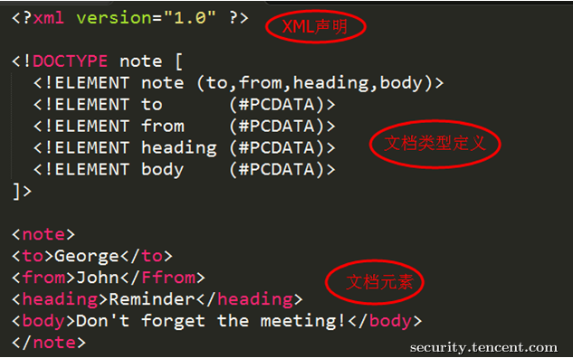

## 14.1 XML基础知识

### 14.1.1 XML文档结构

XML用于标记电子文件使其具有结构性的标记语言，可以用来标记数据、定义数据类型，
是一种允许用户对自己的标记语言进行定义的源语言。
XML文档结构包括XML声明、DTD文档类型定义（可选）、文档元素。

> 图 XML文档结构




DTD（文档类型定义）的作用是定义 XML 文档的合法构建模块。DTD 可以在 XML 文档内声明，也可以外部引用。


+ 内部声明DTD

根元素 [元素声明]>

+ 引用外部DTD

根元素 SYSTEM "文件名">

或者

根元素 PUBLIC "public_ID" "文件名">


DTD实体是用于定义引用普通文本或特殊字符的快捷方式的变量，可以内部声明或外部引用。

内部声明实体

实体名称 "实体的值">

引用外部实体

实体名称 SYSTEM "URI">

或者

实体名称 PUBLIC "public_ID" "URI">


### 14.1.2 实体

实体叫ENTITY，实体的作用是避免重复输入。 在XML中，有5个预定义的实体引用。

```java
<!DOCTYPE 根元素 <!ENTITY 实体名 "实体内容"> ]>
        引用已定义的实体： &实体名;
```

