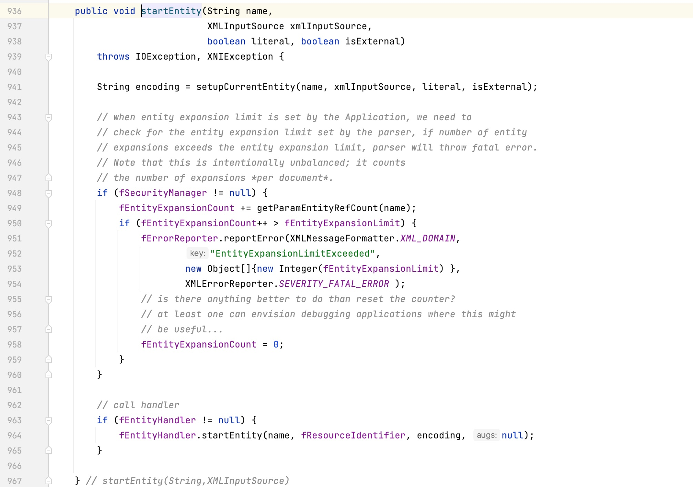
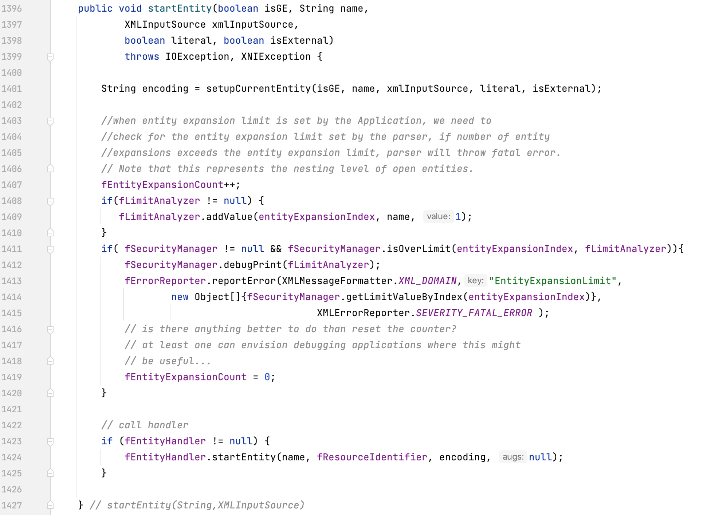
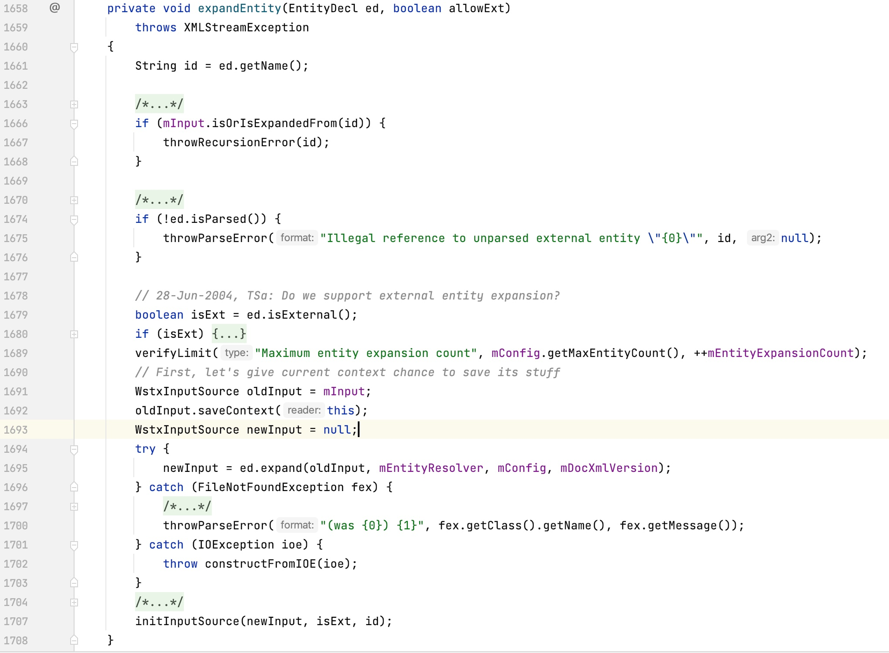

## 14.4 Hook点选取与检测算法

### 14.4.1 Hook类选择

尽管解析XML的中间件非常多，但是最终的实体解析部分在apache.xerces上。

+ 开源工具 org.apache.xerces

org.apache.xerces.impl.XMLEntityManager#startEntity(String, org.apache.xerces.xni.parser.XMLInputSource, boolean, boolean)

+ JDK自带的apache.xerces工具

com.sun.org.apache.xerces.internal.impl.XMLEntityManager#startEntity(boolean, String, com.sun.org.apache.xerces.internal.xni.parser.XMLInputSource, boolean, boolean)

可以看出上面的2个hook点除了包名称不一样之外，参数列表还存在一些差异。

+ 开源工具 com.ctc.wstx

com.ctc.wstx.sr.StreamScanner#expandEntity(com.ctc.wstx.ent.EntityDecl, boolean)

### 14.4.2 检测算法

+ 协议限制

在Java中可以利用的协议有：
ftp, mailto, netdoc, gopher, dict, url、http, file

+ 外部实体文件黑名单

