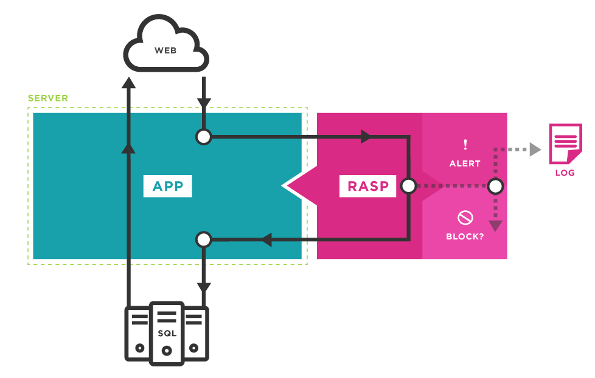
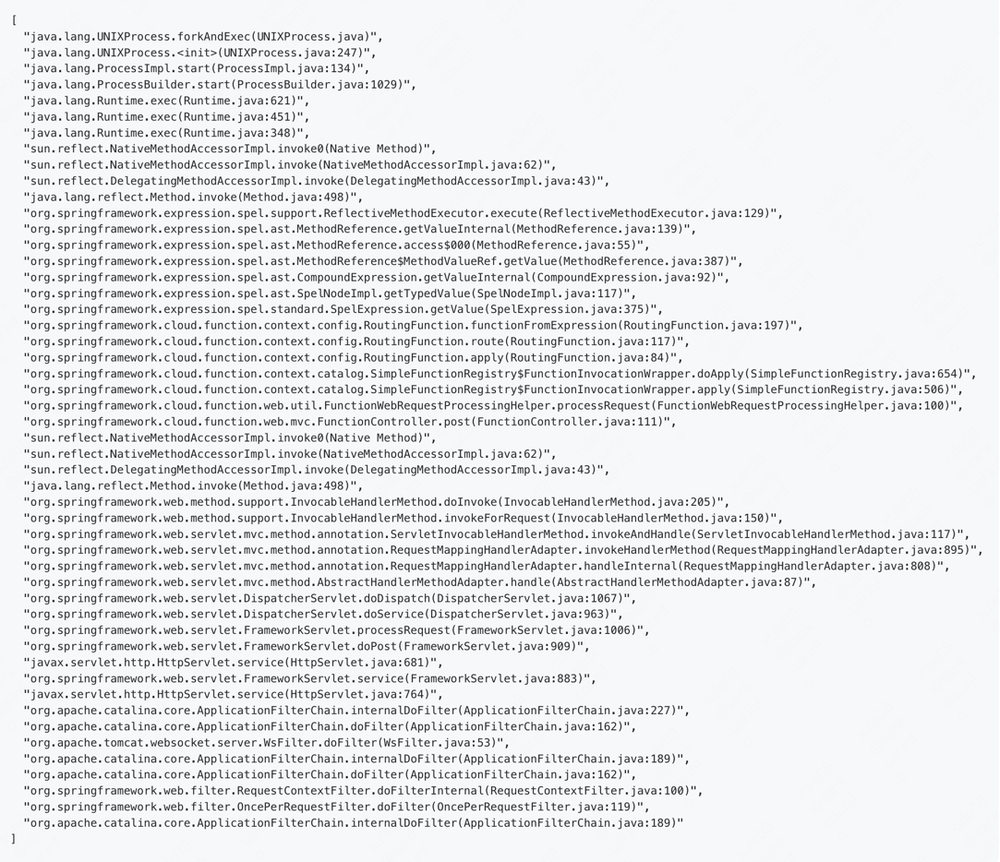
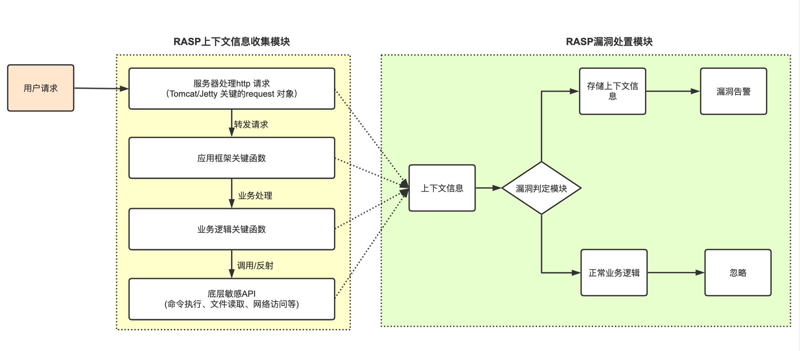

# 背景介绍

##  安全现状
传统的应用安全防护采用防火墙（WAF）部署在Web应用前线，通过对HTTP/HTTPS的有目的性的策略来达到对Web应用的保护。Web应用程序防火墙在HTTP流量到达应用服务器之前对其进行分析，但是基于流量的检测分析手段容易被绕过。

仅仅通过查看HTTP请求来判断攻击属性是片面的，很容易造成漏洞的错误甄别从而对程序带来毁灭性的影响。大量Web应用程序攻击绕过了WAF，并且难以对其进行优化。WAF保护机制仍然需要进一步发展，并且不能成为应用安全计划的唯一支柱。

2020年针对公有云的网络攻击事件整体呈上升趋势，10月达到峰值180万次，主要类型命令注入攻击全年超过170万次。根据腾讯云防火墙拦截到的网络攻击数据，以下列表中的漏洞攻击为2020年攻击利用次数最多的前20名。

2021年度公有云安全报告指出，黑客最常利用的漏洞武器为各种远程代码执行（RCE），其次是扫描探测（指敏感信息探测、WebShell上传探测等），各类命令注入攻击则位居第三。

漏洞利用是黑客云主机攻击的主要通道之一，腾讯安全根据最活跃恶意软件家族使用的漏洞武器，整理出了2021年度黑客最爱的漏洞武器TOP10：

排名第一的是 Apache Log4j2 远程代码执行漏洞，这是近十年来最严重的漏洞，由于使用广泛和漏洞利用简单，影响巨大。
## 什么是RASP

随着 Web 应用攻击手段变得复杂，基于请求特征的防护手段，已经不能满足企业安全防护需求。早在2014 Gartner 引入了“Runtime application self-protection”一词，简称为RASP，属于一种新型应用安全保护技术，它将防护功能"注入"到应用程序中，与应用程序融为一体，通过Hook少量关键函数,来实时观测程序运行期间的内部情况。当应用出现可疑行为时,RASP根据当前上下文环境精准识别攻击事件，并给予实时阻断，使应用程序具备自我防护能力，而不需要进行人工干预。

RASP 通过实时采集 Web 应用的高风险行为，通过特征规则、上下文语义分析及第三方安全产品数据关联分析等多种安全模型来提升检测准确率，相较于传统 Web 应用安全产品，RASP从海量的攻击中排除掉了大量的无效攻击，聚焦发现真实的已知和未知安全威胁。并且在发出的报警信息上, RASP可以清晰的还原出代码行级别的攻击路径，对漏洞重现与修复具有极大的帮助。

图1-3 RASP运行原理图

## RASP能做什么

抵御未知攻击。相比于传统的边界产品，RASP不过度依赖检测规则。2021年波及范围较广的Log4j2事件中，RASP展示出它过人的优势。在Web应用安全中，攻击的入口防不胜防，但最终攻击的方式是固定的。同样作为拦截漏洞，边界产品面对新产生的漏洞，由于没有对应的规则可以说是全军覆没；

● RASP 的防护层深入代码上下文，可以基于行为来精准识别攻击，并提供受到攻击影响的相关代码调用堆栈， 协助安全团队迅速定位问题并快速制定解决方案。

图1-4为2022年出现的Spring Cloud Function SPEL表达式注入漏洞的调用栈，通过调用栈的代码和行号，可以准确无误的复现漏洞（后面的章节会详细分析该漏洞利用原理和检测算法）。

图1-4 Spring Cloud Function SPEL表达式注入漏洞的调用栈

● 利用 RASP 也能够对应用打虚拟补丁，修复官方未修复的漏洞。特别是对大型复杂系统，不允许重新启动的情况下，热修复机制能够及时对漏洞止血，大大降低漏洞逃逸时间，通过增加新的函数 Hook、规则等措施，在较短时间内完成整个企业、全部服务的安全加固。

● RASP赋能扫描器实现灰盒检测(IAST)。其在预发环境、测试环境等方面发挥作用，实现多层产品，层层检测的效果。

● 第三方组件安全风险梳理。以Java 为例子，RASP 运行在JVM内部，能够准确获取JVM加载的jar文件版本、路径等信息，理论上不存在误报和漏报。结合第三方CVE漏洞信息库，能够评估当前系统的风险等级。相对于扫描磁盘文件、POM文件解析、查看进程加载的文件的方式，准确性更高。

## WAF VS RASP

传统的 WAF 主要通过分析流量中的特征过滤攻击请求，并拦截携带有攻击特征的请求。WAF
虽然可以有效个过滤出绝大多数恶意请求，但是不知道应用运行时的上下文，必然会造成一定程度的误报。并且 WAF 严重依赖于特征库，各种花式绕过，导致特征编写很难以不变应万变。

RASP 的不同就在于运行在应用之中，与应用融为一体，可以获取到应用运行时的上下文，根据运行时上下文或者敏感操作，对攻击进行精准的识别或拦截。与此同时，由于 RASP 运行在应用之中，只要检测点选取合理，获取到的 payload 已经是解码过的真实 payload ，可以减少由于 WAF
规则的不完善导致的漏报。

RASP 拥有 WAF 所不具有的一些优势，越来越成为安全防御体系的标配。而 WAF 是成熟、快速、可以大规模部署的安全产品。WAF和RASP是互补的，这是两个纬度的东西。两者的核心区别还是rasp可以更准确的拦截漏洞，甚至能拦0day，而waf机制基于流量决定了他并不能完整的了解业务内部运转逻辑，且容易被绕过，另外waf大多也只是http协议的，rasp可以不关心协议也能拦截。RASP的解决问题场景，还没有那么直接。更像疫苗，构建的是基于体内信号的免疫力，WAF更像是口罩防护服，很多场景立竿见影，在应用外面包一层盔甲来防御。waf和rasp两者相互补充，将 WAF 作为应用外围的防线，RASP 作为应用自身的安全防护，确保对攻击的有效拦截。

RASP与WAF并不是相互取代的关系，二者在不同业务和安全防护场景下各有所长。对于应用防护来说，协同构建边界与应用内生双重防护能力，最大程度降低应用被入侵、数据泄露、服务不可用等风险。

## 实现基本思路
&emsp;&emsp;目前 RASP 的主方向还是 Java RASP, 它的实现方式是通过Instrumentation编写一个agent，在 agent 中加入 hook 点，当程序运行流程到了 hook 点时，将检测流程插入到字节码文件中，统一进入JVM中执行。

## 本章小结

本章主要介绍了Java RASP技术基础、漏洞检测原理、热修复等，并探讨了RASP相对于其它安全产品的优势以及当前RASP部署实践中存在的问题。
本章仅仅对RASP的使用场景做了一些介绍，后面的章节将详细介绍其中的技术细节。

