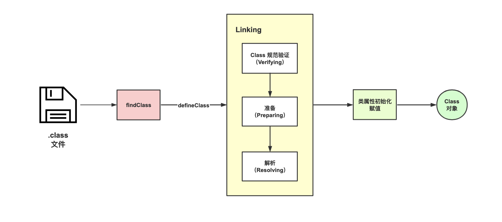

## ClassLoader基本方法和实现类

ClassLoader是一个抽象类，不能直接使用，因此我们需要继承并重写其中的方法。
它的主要方法有defineClass、loadClass、findClass和resolveClass等及其重载方法。
方法的定义如下：
```java
 // 方法的输入是字节码的byte数组，输出是Class对象，它的作用是将别字节码数组解析JVM能够识别的Class对象
 protected final Class<?> defineClass(String name, byte[] b, int off, int len)
 
 // 通过类名称查找Class对象
 public Class<?> loadClass(String name)
 
 // 通过类全限定名称加载类
 protected Class<?> findClass(String name)

 // 调用该方法完成类的链接过程
 protected final void resolveClass(Class<?> c)
```

先来实现一个简单的类加载器NetworkClassLoader，这个类加载器具备从网络加载类文件的能力， 实现代码如下：
```java
import java.io.ByteArrayOutputStream;
import java.io.IOException;
import java.io.InputStream;
import java.net.URL;

public class NetworkClassLoader extends ClassLoader {
    
    // 下载地址
    private String downloadUrl;

    public NetworkClassLoader(String downloadUrl) {
        this.downloadUrl = downloadUrl;
    }

    // 实现类的查找方法
    @Override
    public Class findClass(String name) {
        byte[] b = loadClassData(name);
        return defineClass(name, b, 0, b.length);
    }
    
    // 从远程下载类文件，从而获得类的字节码数组
    private byte[] loadClassData(String name) {
        // load the class data from the connection
        InputStream input = null;
        ByteArrayOutputStream baos = null;
        String path = classNameToPath(name);
        try {
            URL url = new URL(path);
            byte[] buff = new byte[1024 * 4];
            int len = -1;
            input = url.openStream();
            baos = new ByteArrayOutputStream();
            while ((len = input.read(buff)) != -1) {
                baos.write(buff, 0, len);
            }
        } catch (Exception e) {
            e.printStackTrace();
        } finally {
            if (input == null) {
                try {
                    input.close();
                } catch (IOException e) {
                    e.printStackTrace();
                }
            }
        }
        return baos.toByteArray();
    }
    
    // 类名称转化为服务器下载的地址
    private String classNameToPath(String name) {
        return downloadUrl + "/" + name.replace(".", "/") + ".class";
    }

    // 测试方法
    public class Main {
        public static void main(String[] args) throws Exception {
            // 下载地址
            String baseUrl = "https://wwww.jrasp.com";
            // 初始化网络类加载器
            NetworkClassLoader loader = new NetworkClassLoader(baseUrl);
            // 加载位于 https://wwww.jrasp.com/Foo.class的类，并创建实例
            Object foo = loader.loadClass("Foo").newInstance();
        }
    }
}
```

被加载的类Foo是一个简单类，在创建实例对象时输出"create new instance"，Foo类的代码如下：
```java
public class Foo {
    public Foo() {
        System.out.println("create new instance");
    }
}
```

运行Main方法，输出结果如下：
```text
create new instance
```

ClassLoader中主要功能是类查找、加载和链接等过程，除了加载类之外，
类加载器还负责加载资源如配置文件或图片等如getResource方法，可以用来加载文件。

## ClassLoader源码解析

有了上面的使用基础，再来分析下类加载器的源码。

### loadClass

ClassLoader是调用其loadClass方法来加载class的，loadClass核心代码如下：
```java
protected Class<?> loadClass(String name, boolean resolve)
    throws ClassNotFoundException {
    synchronized (getClassLoadingLock(name)) {
        // 1.从缓存中查找当前类
        Class<?> c = findLoadedClass(name);
        if (c == null) {
            try {
                if (parent != null) {
                    // 2.1 当前类加载器的父加载不为空，尝试从父类加载器加载
                    c = parent.loadClass(name, false);
                } else {
                    // 2.2 父加载器为空，使用启动类加载器加载
                    c = findBootstrapClassOrNull(name);
                }
            } catch (ClassNotFoundException e) {
                // 忽略 ClassNotFoundException 异常，继续查找
            }

            if (c == null) {
                // 3. 如果查找失败，调用当前类加载器重写的findClass查找
                c = findClass(name);
            }
        }
        
        // 链接类
        if (resolve) {
            resolveClass(c);
        }
        return c;
    }
}
```
上面的类加载顺序可以总结为：
优先从尝试父加载器去加载（如果父加载器为null，则调用系统类加载器BootstrapClassLoader去加载），
父加载器都尝试失败后才会交由当前ClassLoader重写的findClass方法去加载。

### findClass
在加载class的过程中，如果父加载器都没有找到，则调用子类加载器重写的findClass方法继续查找，
findClass方法如下。
```java
protected Class<?> findClass(String name) throws ClassNotFoundException {
    // 调用时抛出异常  
    throw new ClassNotFoundException(name);
}
```
可以看到该方法里面抛出异常，因此不能直接调用，需要子类来实现。

### defineClass
defineClass与findClass一起使用，findClass负责读取自于磁盘或者网络的字节码，
而defineClass将字节码解析为Class对象，
在defineClass方法中使用resolveClass方法完成对Class的链接。源代码如下。
```java
protected final Class<?> defineClass(String name, byte[] b, int off, int len,
                                     ProtectionDomain protectionDomain)
    throws ClassFormatError {
    protectionDomain = preDefineClass(name, protectionDomain);
    String source = defineClassSourceLocation(protectionDomain);
    // 调用 native 方法完成链接
    Class<?> c = defineClass1(name, b, off, len, protectionDomain, source);
    postDefineClass(c, protectionDomain);
    return c;
}
```
defineClass的实现在defineClass1方法中，defineClass1是一个native方法，
具体实现hotspot中，实现较为复杂，一般不需要特别关注。

ClassLoader加载一个class文件到JVM时需要经过的步骤:



一般我们只需要重写ClassLoader的findClass方法获取需要加载的类的字节码，
然后调用defineClass方法生成Class对象。
如果想要在类加载到JVM中时就被链接，可以调用resolveClass方法，也可以选择交给JVM在类初始化时链接。

## ClassLoader的重要实现类

### URLClassLoader

```java
// 类和资源的查找路径
private final URLClassPath ucp;

public URLClassLoader(URL[] urls, ClassLoader parent) {
    super(parent);
    // ... 权限检查代码省略
    this.acc = AccessController.getContext();
    // 初始化 ucp 属性
    ucp = new URLClassPath(urls, acc);
}
```

下面是findClass的实现。
```java
protected Class<?> findClass(final String name) throws ClassNotFoundException {
    // 1、将类的全限定名变成.class文件路径的方式
    String path = name.replace('.', '/').concat(".class");
    // 2、在URLClassPath中查找是否存在
    Resource res = ucp.getResource(path, false);
    // ... 异常处理忽略
    return defineClass(name, res);
}
```

findClass方法的执行逻辑主要分为三步：
+ 将类的全限定名变成.class文件路径的方式；
+ 在URL中查找文件是否存在；
+ 调用defineClass完成类的链接和初始化；

