# 创建配置

> jrasp-agent 安装包中包含了默认配置，能满足一般情况的使用，如果需要定制策略，则需要对配置进行修改

## 方案1：官方提供的策略包导入(推荐)

jrasp 官方提供了可以导入的完整包。 下载通用策略包：
```java
wget https://www.download.jrasp.com/v1.1.3/export_%E9%BB%98%E8%AE%A4%E9%85%8D%E7%BD%AE.zip
```
导入zip文件


## 方案2：源码编译后上传(定制)

### 01.模块jar包上传

将模块批量上传到管理端。

模块可以来自于jrasp-agent安装包或者jrasp-agent源码编译输出

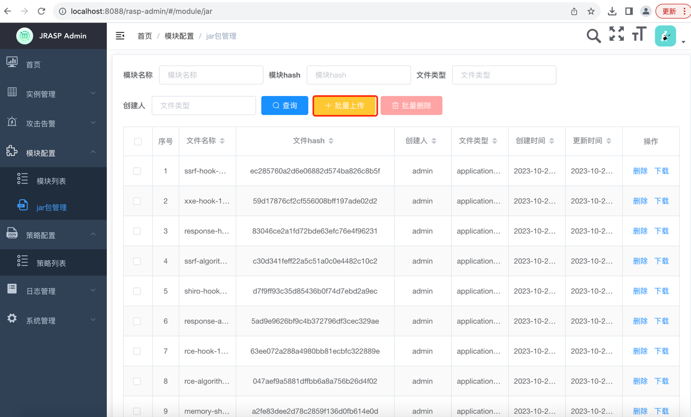


### 0.2模块配置

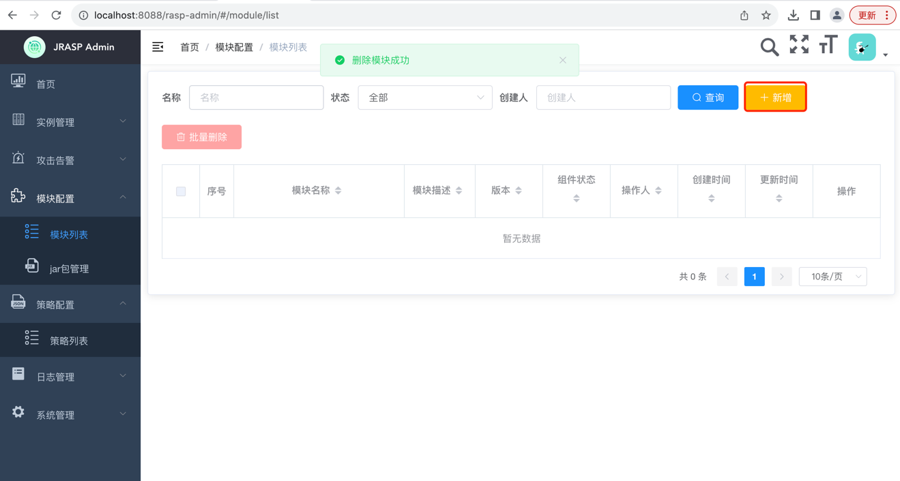


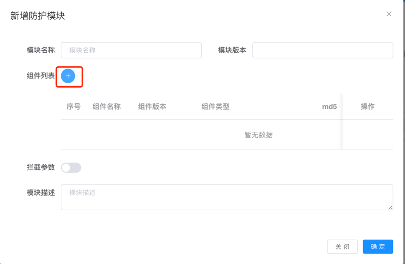


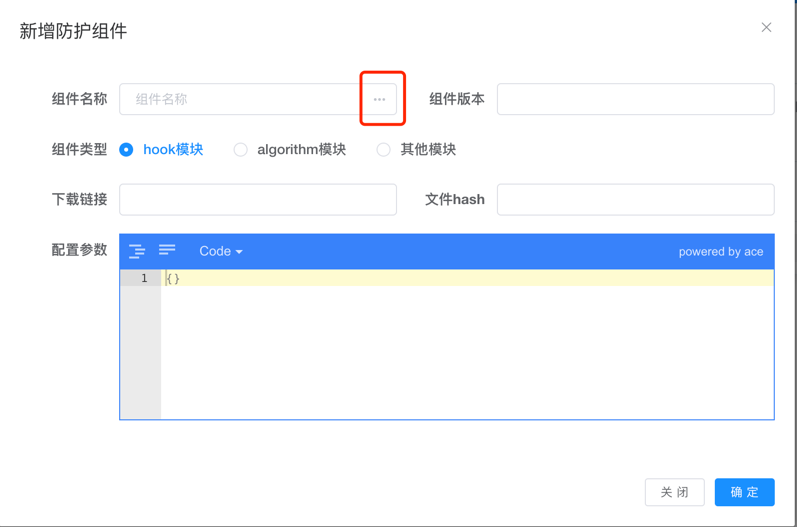

一个防护组件一般包含2个jar包（hook模块+算法模块）

先添加rce-hook模块
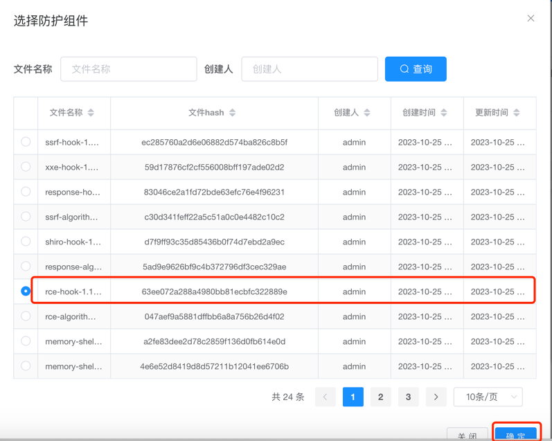

选中模块后，显示可以配置的参数 


确定


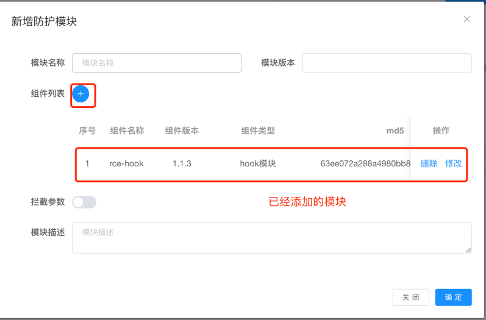


在此添加rce-algorithm模块

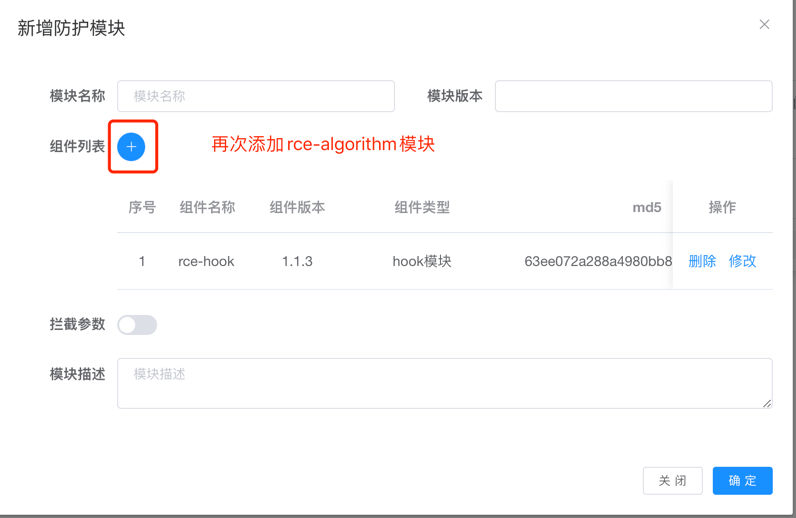


添加2个模块后，一个防护组件就完成了


确认模块其他信息
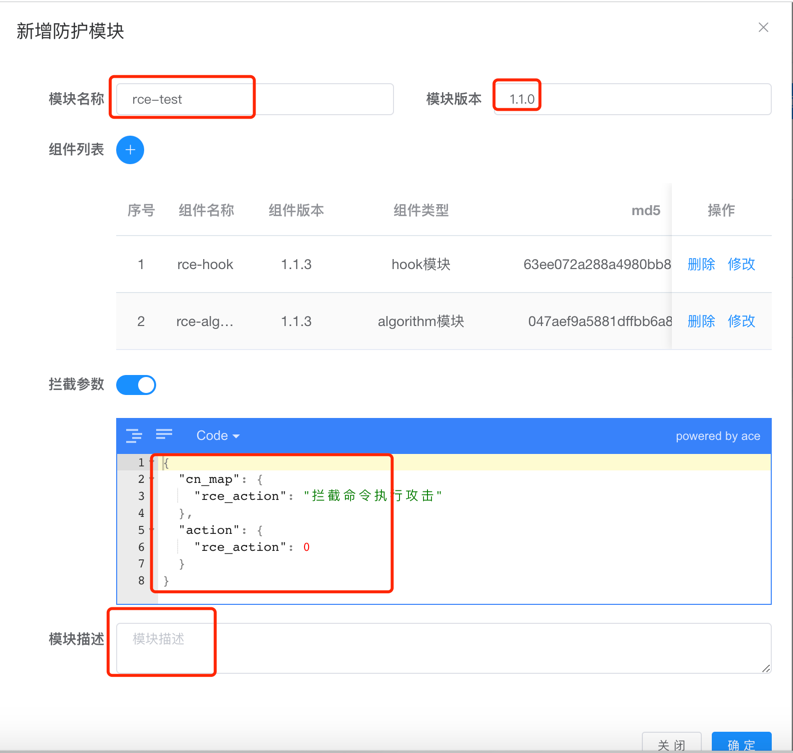


其他模块按照相同方案配置。

## 0.3新增配置


选择刚才生成的rce-test （其他防护模块生成方式一样）

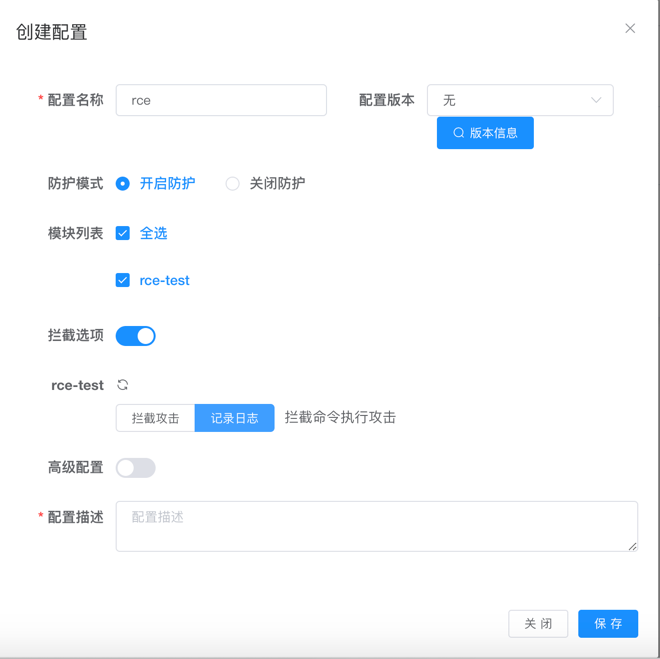


生成的配置：


## 0.4配置下发


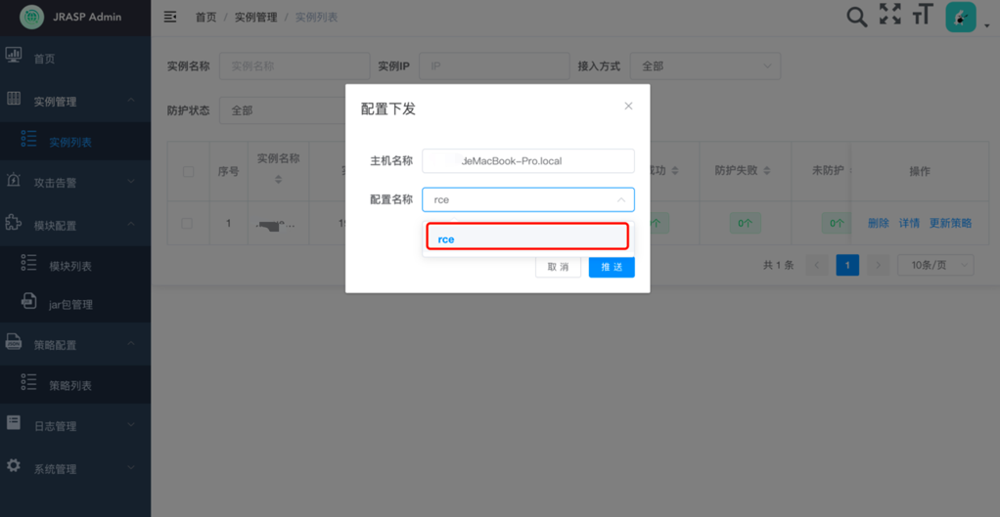


## 0.5 策略包导出


上面配置过程较为繁琐，20+jar包配置比较复杂。但是配置一次之后，就可以复用了。


如果有多个管理端，可以将刚才导出的压缩包倒入到新的管理端中，避免反复配置。

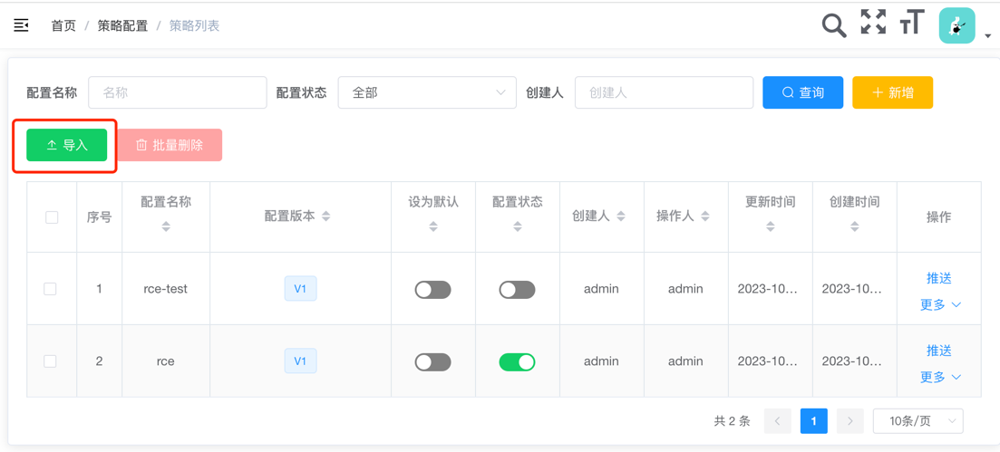

