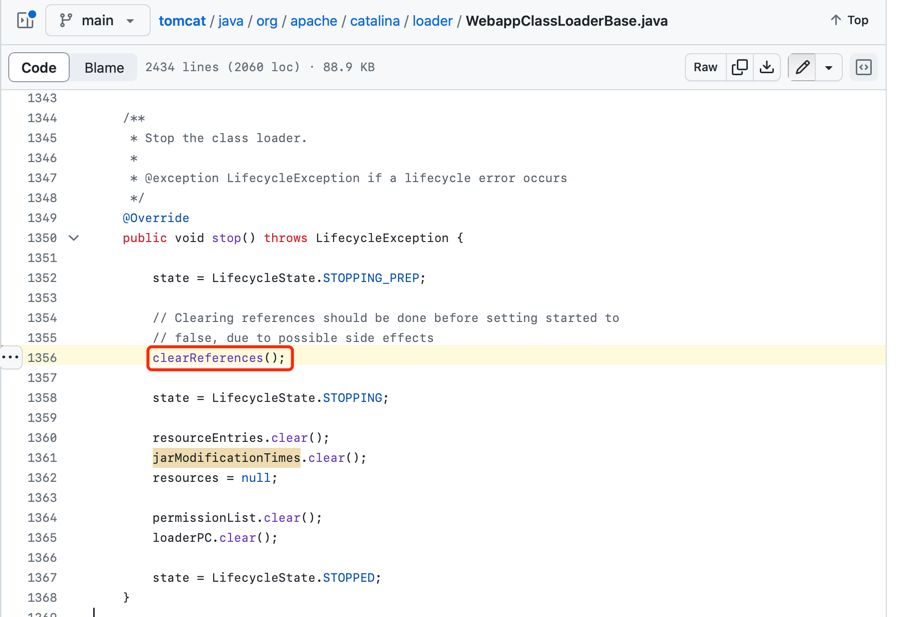

# 内存泄漏检测与清除方案

热加载与卸载已经成为RASP的标配，而涉及到插件或者脚本的卸载问题，却少有技术文档提及，
主要原因是开发人员更多的偏向安全方向，对此了解不多。本文将介绍JRASP在这方面的实践。

## 类卸载的条件
类卸载的条件十分苛刻，要同时满足下面的三个条件：
+ 类所有的实例已经被回收;
+ 加载该类的Classloder已经被回收;
+ 该类对应的java.lang.Class对象没有任何对方被引用;

由java虚拟机自带的三种类加载加载的类在虚拟机的整个生命周期中是不会被卸载的，由用户自定义的类加载器所加载的类才可以被卸载。

卸载的操作可以用一个简单的话描述就是`将对象置为null`，但是对于线程变量，如果在使用完成后，没有即时的调用`threadlocal.remove()`,将导致严重内存泄漏。

内存泄漏引用路径：

GC Roots ---> Thread ---> threadlocal ---> threadlocal的class对象 ---> rasp core classloader ---> 其他core中的的class


## tomcat war部署中的资源清除与内存泄漏检测

tomcat在卸载war包时，调用war的类加载器`WebappClassLoaderBase`对象的stop方法完成资源的关闭与清理操作。


具体的引用清除实现来在`clearReferences`中，主要有：注销JDBC驱动、关闭应用创建的线程、检查线程变量的内存泄漏等，关闭连接和线程的操作容易实现，本节主要针对线程变量的内存泄漏清理与检测。

### 线程变量泄漏检测

在线程Thread对象中使用两个字段保存该线程使用的`threadlocal`对象：
```java
public class Thread implements Runnable {
    
    /* ThreadLocal values pertaining to this thread. This map is maintained
     * by the ThreadLocal class. */
    ThreadLocal.ThreadLocalMap threadLocals = null;

    /*
     * InheritableThreadLocal values pertaining to this thread. This map is
     * maintained by the InheritableThreadLocal class.
     */
    ThreadLocal.ThreadLocalMap inheritableThreadLocals = null;
    
    // 其他代码省略...
}   
```
threadLocals的类型是`ThreadLocalMap`，ThreadLocalMap中用数组table保存threadlocal变量的key、value。
因此最终我们需要清理的是这个table里面的Entry。
```java
static class ThreadLocalMap {
    
    static class Entry extends WeakReference<ThreadLocal<?>> {
        Object value;
        Entry(ThreadLocal<?> k, Object v) {
            super(k);
            value = v;
        }
    }
    
    // 保存threadlocal变量的key、value
    private Entry[] table;
}    
```

tomcat中线程变量的内存泄漏检测代码在`checkThreadLocalsForLeaks`中。
```java
private void checkThreadLocalsForLeaks() {
     // 获取 jvm 全部线程
     Thread[] threads = getThreads();
     try {
         // 反射获取threadLocals、inheritableThreadLocals
         Field threadLocalsField = Thread.class.getDeclaredField("threadLocals");
         threadLocalsField.setAccessible(true);
         Field inheritableThreadLocalsField = Thread.class.getDeclaredField("inheritableThreadLocals");
         inheritableThreadLocalsField.setAccessible(true);
         
         // 反射获取ThreadLocalMap的table字段
         Class<?> tlmClass = Class.forName("java.lang.ThreadLocal$ThreadLocalMap");
         Field tableField = tlmClass.getDeclaredField("table");
         tableField.setAccessible(true);
         
         // 反射获取expungeStaleEntries方法，该方法的作用是清除所有过期的entry
         Method expungeStaleEntriesMethod = tlmClass.getDeclaredMethod("expungeStaleEntries");
         expungeStaleEntriesMethod.setAccessible(true);
         
         //　遍历所有线程，清除引用
         for (Thread thread : threads) {
             Object threadLocalMap;
             if (thread != null) {

                 // 清除 threadLocalsField 字段引用的对象
                 threadLocalMap = threadLocalsField.get(thread);
                 if (null != threadLocalMap) {
                     expungeStaleEntriesMethod.invoke(threadLocalMap);
                     // 检测已经被完全清楚干净，如果发现entry的key或者value对象的类是由当前类的war包加载器加载
                     // 说明依然存在内存泄漏，需要进行修复。
                     checkThreadLocalMapForLeaks(threadLocalMap, tableField);
                 }

                 // 清除 inheritableThreadLocalsField 字段引用的对象
                 threadLocalMap = inheritableThreadLocalsField.get(thread);
                 if (null != threadLocalMap) {
                     expungeStaleEntriesMethod.invoke(threadLocalMap);
                     checkThreadLocalMapForLeaks(threadLocalMap, tableField);
                 }
             }
         }
     } catch (InaccessibleObjectException e) {
         // Must be running on without the necessary command line options.
         log.warn(sm.getString("webappClassLoader.addExportsThreadLocal", getCurrentModuleName()));
     } catch (Throwable t) {
         ExceptionUtils.handleThrowable(t);
         log.warn(sm.getString("webappClassLoader.checkThreadLocalsForLeaksFail", getContextName()), t);
     }
 }
```


## 内存泄漏诊断


## 